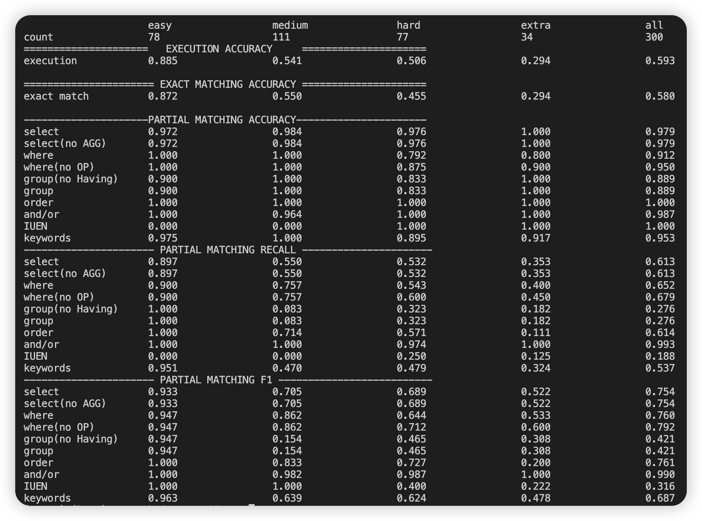

               (.venv) (base) yangenhui@mac spider % python evaluation.py --gold a.sql --pred b.sql --etype all --db spider_data/test_database --table spider_data/test_tables.json
eval_err_num:1
medium pred: SELECT p.Name FROM player p JOIN club c ON p.Club_ID = c.Club_ID WHERE c.Manager = 'Sam Allardyce';
medium gold: SELECT T2.Name FROM club AS T1 JOIN player AS T2 ON T1.Club_ID  =  T2.Club_ID WHERE T1.Manager  =  "Sam Allardyce"

eval_err_num:2
hard pred: SELECT c.Name FROM club c JOIN player p ON c.Club_ID = p.Club_ID GROUP BY c.Name, c.Club_ID ORDER BY AVG(p.Earnings) DESC
hard gold: SELECT T1.Name FROM club AS T1 JOIN player AS T2 ON T1.Club_ID  =  T2.Club_ID GROUP BY T1.Club_ID ORDER BY avg(T2.Earnings) DESC

hard pred: SELECT club.Name FROM club JOIN player ON club.Club_ID = player.Club_ID GROUP BY club.Name ORDER BY AVG(player.Earnings) DESC
hard gold: SELECT T1.Name FROM club AS T1 JOIN player AS T2 ON T1.Club_ID  =  T2.Club_ID GROUP BY T1.Club_ID ORDER BY avg(T2.Earnings) DESC

eval_err_num:3
medium pred: SELECT Manufacturer, COUNT(*) AS club_count FROM club GROUP BY Manufacturer
medium gold: SELECT Manufacturer ,  COUNT(*) FROM club GROUP BY Manufacturer

eval_err_num:4
medium pred: SELECT Manufacturer, COUNT(*) AS club_count FROM club GROUP BY Manufacturer
medium gold: SELECT Manufacturer ,  COUNT(*) FROM club GROUP BY Manufacturer

eval_err_num:5
hard pred: SELECT Manufacturer, COUNT(*) as count FROM club GROUP BY Manufacturer ORDER BY count DESC LIMIT 1;
hard gold: SELECT Manufacturer FROM club GROUP BY Manufacturer ORDER BY COUNT(*) DESC LIMIT 1

eval_err_num:6
hard pred: SELECT Manufacturer, COUNT(*) as count FROM club GROUP BY Manufacturer ORDER BY count DESC LIMIT 1
hard gold: SELECT Manufacturer FROM club GROUP BY Manufacturer ORDER BY COUNT(*) DESC LIMIT 1

eval_err_num:7
hard pred: SELECT c.Name FROM club c WHERE NOT EXISTS (SELECT 1 FROM player p WHERE p.Club_ID = c.Club_ID)
hard gold: SELECT Name FROM club WHERE Club_ID NOT IN (SELECT Club_ID FROM player)

eval_err_num:8
hard pred: SELECT c.Name FROM club c LEFT JOIN player p ON c.Club_ID = p.Club_ID WHERE p.Club_ID IS NULL
hard gold: SELECT Name FROM club WHERE Club_ID NOT IN (SELECT Club_ID FROM player)

hard pred: SELECT Country FROM player WHERE Earnings > 1400000 OR Earnings < 1100000;
hard gold: SELECT Country FROM player WHERE Earnings  >  1400000 INTERSECT SELECT Country FROM player WHERE Earnings  <  1100000

hard pred: SELECT Country FROM player GROUP BY Country HAVING MAX(Earnings) > 1400000 AND MIN(Earnings) < 1100000
hard gold: SELECT Country FROM player WHERE Earnings  >  1400000 INTERSECT SELECT Country FROM player WHERE Earnings  <  1100000

easy pred: SELECT COUNT(*) FROM (SELECT DISTINCT Country FROM player);
easy gold: SELECT COUNT (DISTINCT Country) FROM player

eval_err_num:9
medium pred: SELECT Earnings FROM player WHERE Country IN ('Australia', 'Zimbabwe')
medium gold: SELECT Earnings FROM player WHERE Country  =  "Australia" OR Country  =  "Zimbabwe"

eval_err_num:10
extra pred: SELECT c.customer_id, c.customer_first_name, c.customer_last_name FROM Customers c JOIN Orders o ON c.customer_id = o.customer_id JOIN Order_Items oi ON o.order_id = oi.order_id GROUP BY c.customer_id, c.customer_first_name, c.customer_last_name HAVING COUNT(DISTINCT o.order_id) > 2 AND COUNT(oi.order_item_id) >= 3
extra gold: SELECT T1.customer_id ,  T1.customer_first_name ,  T1.customer_last_name FROM Customers AS T1 JOIN Orders AS T2 ON T1.customer_id  =  T2.customer_id GROUP BY T1.customer_id HAVING count(*)  >  2 INTERSECT SELECT T1.customer_id ,  T1.customer_first_name ,  T1.customer_last_name FROM Customers AS T1 JOIN Orders AS T2 ON T1.customer_id  =  T2.customer_id JOIN Order_items AS T3 ON T2.order_id  =  T3.order_id GROUP BY T1.customer_id HAVING count(*)  >= 3

eval_err_num:11
medium pred: SELECT o.order_id, o.order_status_code, COUNT(oi.order_item_id) AS product_count FROM Orders o JOIN Order_Items oi ON o.order_id = oi.order_id GROUP BY o.order_id, o.order_status_code
medium gold: SELECT T1.order_id ,  T1.order_status_code ,  count(*) FROM Orders AS T1 JOIN Order_items AS T2 ON T1.order_id  =  T2.order_id GROUP BY T1.order_id

eval_err_num:12
medium pred: SELECT o.order_id, o.order_status_code, COUNT(oi.product_id) AS product_count FROM Orders o JOIN Order_Items oi ON o.order_id = oi.order_id GROUP BY o.order_id, o.order_status_code
medium gold: SELECT T1.order_id ,  T1.order_status_code ,  count(*) FROM Orders AS T1 JOIN Order_items AS T2 ON T1.order_id  =  T2.order_id GROUP BY T1.order_id

eval_err_num:13
hard pred: SELECT DISTINCT o.date_order_placed FROM Orders o WHERE o.date_order_placed = (SELECT MIN(date_order_placed) FROM Orders) OR o.order_id IN (SELECT order_id FROM Order_Items GROUP BY order_id HAVING COUNT(*) > 1)
hard gold: SELECT min(date_order_placed) FROM Orders UNION SELECT T1.date_order_placed FROM Orders AS T1 JOIN Order_items AS T2 ON T1.order_id  =  T2.order_id GROUP BY T1.order_id HAVING count(*)  >  1

extra pred: SELECT customer_first_name, customer_middle_initial, customer_last_name FROM Customers WHERE customer_id NOT IN (SELECT customer_id FROM Orders)
extra gold: SELECT customer_first_name ,  customer_middle_initial ,  customer_last_name FROM Customers EXCEPT SELECT T1.customer_first_name ,  T1.customer_middle_initial ,  T1.customer_last_name FROM Customers AS T1 JOIN Orders AS T2 ON T1.customer_id  =  T2.customer_id

eval_err_num:14
extra pred: SELECT c.customer_first_name, c.customer_last_name, c.customer_middle_initial FROM Customers c LEFT JOIN Orders o ON c.customer_id = o.customer_id WHERE o.order_id IS NULL
extra gold: SELECT customer_first_name ,  customer_middle_initial ,  customer_last_name FROM Customers EXCEPT SELECT T1.customer_first_name ,  T1.customer_middle_initial ,  T1.customer_last_name FROM Customers AS T1 JOIN Orders AS T2 ON T1.customer_id  =  T2.customer_id

eval_err_num:15
extra pred: SELECT p.product_id, p.product_name, p.product_price, p.product_color FROM Products p LEFT JOIN Order_Items oi ON p.product_id = oi.product_id GROUP BY p.product_id, p.product_name, p.product_price, p.product_color HAVING COUNT(oi.order_item_id) < 2
extra gold: SELECT product_id ,  product_name ,  product_price ,  product_color FROM Products EXCEPT SELECT T1.product_id ,  T1.product_name ,  T1.product_price ,  T1.product_color FROM Products AS T1 JOIN Order_items AS T2 ON T1.product_id  =  T2.product_id JOIN Orders AS T3 ON T2.order_id  =  T3.order_id GROUP BY T1.product_id HAVING count(*)  >=  2

eval_err_num:16
hard pred: SELECT p.product_id, p.product_name, p.product_price, p.product_color FROM Products p LEFT JOIN Order_Items oi ON p.product_id = oi.product_id GROUP BY p.product_id, p.product_name, p.product_price, p.product_color HAVING COUNT(DISTINCT oi.order_id) < 2
hard gold: select t1.product_id ,  t1.product_name ,  t1.product_price ,  t1.product_color from products as t1 join order_items as t2 on t1.product_id  =  t2.product_id join orders as t3 on t2.order_id  =  t3.order_id group by t1.product_id having count(*) < 2

eval_err_num:17
medium pred: SELECT o.order_id, o.date_order_placed FROM Orders o JOIN Order_Items oi ON o.order_id = oi.order_id GROUP BY o.order_id, o.date_order_placed HAVING COUNT(oi.order_item_id) >= 2
medium gold: SELECT T1.order_id ,  T1.date_order_placed FROM Orders AS T1 JOIN Order_items AS T2 ON T1.order_id  =  T2.order_id GROUP BY T1.order_id HAVING count(*)  >=  2

eval_err_num:18
medium pred: SELECT o.order_id, o.date_order_placed FROM Orders o JOIN Order_Items oi ON o.order_id = oi.order_id GROUP BY o.order_id, o.date_order_placed HAVING COUNT(DISTINCT oi.product_id) >= 2
medium gold: SELECT T1.order_id ,  T1.date_order_placed FROM Orders AS T1 JOIN Order_items AS T2 ON T1.order_id  =  T2.order_id GROUP BY T1.order_id HAVING count(*)  >=  2

eval_err_num:19
extra pred: SELECT p.product_id AS id, p.product_name AS "product name", p.product_price AS price FROM Order_Items oi JOIN Products p ON oi.product_id = p.product_id GROUP BY p.product_id, p.product_name, p.product_price ORDER BY COUNT(oi.order_item_id) DESC LIMIT 1
extra gold: SELECT T1.product_id ,  T1.product_name ,  T1.product_price FROM Products AS T1 JOIN Order_items AS T2 ON T1.product_id  =  T2.product_id GROUP BY T1.product_id ORDER BY count(*) DESC LIMIT 1

eval_err_num:20
extra pred: SELECT oi.order_id, SUM(p.product_price) AS total_price FROM Order_Items oi JOIN Products p ON oi.product_id = p.product_id GROUP BY oi.order_id ORDER BY total_price ASC LIMIT 1
extra gold: SELECT T1.order_id ,  sum(T2.product_price) FROM Order_items AS T1 JOIN Products AS T2 ON T1.product_id  =  T2.product_id GROUP BY T1.order_id ORDER BY sum(T2.product_price) ASC LIMIT 1

eval_err_num:21
extra pred: SELECT o.order_id, SUM(p.product_price) AS total_cost FROM Orders o JOIN Order_Items oi ON o.order_id = oi.order_id JOIN Products p ON oi.product_id = p.product_id GROUP BY o.order_id ORDER BY total_cost ASC LIMIT 1
extra gold: select t1.order_id ,  sum(t2.product_price) from order_items as t1 join products as t2 on t1.product_id  =  t2.product_id group by t1.order_id order by sum(t2.product_price) asc limit 1

eval_err_num:22
hard pred: SELECT payment_method_code, COUNT(*) as count FROM Customer_Payment_Methods GROUP BY payment_method_code ORDER BY count DESC LIMIT 1
hard gold: SELECT Payment_method_code FROM Customer_Payment_Methods GROUP BY Payment_method_code ORDER BY count(*) DESC LIMIT 1

eval_err_num:23
hard pred: SELECT payment_method_code, COUNT(customer_id) as customer_count FROM Customer_Payment_Methods GROUP BY payment_method_code ORDER BY customer_count DESC LIMIT 1
hard gold: SELECT Payment_method_code FROM Customer_Payment_Methods GROUP BY Payment_method_code ORDER BY count(*) DESC LIMIT 1

eval_err_num:24
hard pred: SELECT c.gender_code, COUNT(oi.product_id) as number_of_products FROM Customers c JOIN Orders o ON c.customer_id = o.customer_id JOIN Order_Items oi ON o.order_id = oi.order_id GROUP BY c.gender_code
hard gold: SELECT T1.gender_code ,  count(*) FROM Customers AS T1 JOIN Orders AS T2 ON T1.customer_id  =  T2.customer_id JOIN Order_items AS T3 ON T2.order_id  =  T3.order_id GROUP BY T1.gender_code

eval_err_num:25
hard pred: SELECT c.gender_code, COUNT(DISTINCT oi.product_id) as product_count FROM Customers c JOIN Orders o ON c.customer_id = o.customer_id JOIN Order_Items oi ON o.order_id = oi.order_id GROUP BY c.gender_code
hard gold: SELECT T1.gender_code ,  count(*) FROM Customers AS T1 JOIN Orders AS T2 ON T1.customer_id  =  T2.customer_id JOIN Order_items AS T3 ON T2.order_id  =  T3.order_id GROUP BY T1.gender_code

eval_err_num:26
medium pred: SELECT c.gender_code, COUNT(o.order_id) as order_count FROM Customers c JOIN Orders o ON c.customer_id = o.customer_id GROUP BY c.gender_code
medium gold: SELECT T1.gender_code ,  count(*) FROM Customers AS T1 JOIN Orders AS T2 ON T1.customer_id  =  T2.customer_id GROUP BY T1.gender_code

eval_err_num:27
medium pred: SELECT c.gender_code, COUNT(o.order_id) as order_count FROM Customers c JOIN Orders o ON c.customer_id = o.customer_id GROUP BY c.gender_code
medium gold: SELECT T1.gender_code ,  count(*) FROM Customers AS T1 JOIN Orders AS T2 ON T1.customer_id  =  T2.customer_id GROUP BY T1.gender_code

eval_err_num:28
medium pred: SELECT c.customer_first_name, c.customer_middle_initial, c.customer_last_name, cpm.payment_method_code FROM Customers c JOIN Customer_Payment_Methods cpm ON c.customer_id = cpm.customer_id
medium gold: SELECT T1.customer_first_name ,  T1.customer_middle_initial ,  T1.customer_last_name ,  T2.Payment_method_code FROM Customers AS T1 JOIN Customer_Payment_Methods AS T2 ON T1.customer_id  =  T2.customer_id

eval_err_num:29
medium pred: SELECT c.customer_first_name, c.customer_middle_initial, c.customer_last_name, cpm.payment_method_code FROM Customers c LEFT JOIN Customer_Payment_Methods cpm ON c.customer_id = cpm.customer_id
medium gold: SELECT T1.customer_first_name ,  T1.customer_middle_initial ,  T1.customer_last_name ,  T2.Payment_method_code FROM Customers AS T1 JOIN Customer_Payment_Methods AS T2 ON T1.customer_id  =  T2.customer_id

eval_err_num:30
medium pred: SELECT i.invoice_status_code, i.invoice_date, s.shipment_date FROM Invoices i JOIN Shipments s ON i.invoice_number = s.invoice_number
medium gold: SELECT T1.invoice_status_code ,  T1.invoice_date ,  T2.shipment_date FROM Invoices AS T1 JOIN Shipments AS T2 ON T1.invoice_number  =  T2.invoice_number

eval_err_num:31
extra pred: SELECT DISTINCT p.product_name, p.product_price, p.product_description FROM Products p JOIN Order_Items oi ON p.product_id = oi.product_id JOIN Orders o ON oi.order_id = o.order_id JOIN Customers c ON o.customer_id = c.customer_id WHERE c.gender_code = 'F'
extra gold: SELECT DISTINCT T1.product_name ,  T1.product_price ,  T1.product_description FROM Products AS T1 JOIN Order_items AS T2 ON T1.product_id  =  T2.product_id JOIN Orders AS T3 ON T2.order_id  =  T3.order_id JOIN Customers AS T4 ON T3.customer_id  =  T4.customer_id WHERE T4.gender_code  =  'Female'

eval_err_num:32
hard pred: SELECT i.invoice_status_code FROM Invoices i LEFT JOIN Shipments s ON i.invoice_number = s.invoice_number WHERE s.shipment_id IS NULL
hard gold: SELECT invoice_status_code FROM Invoices WHERE invoice_number NOT IN ( SELECT invoice_number FROM Shipments )

hard pred: SELECT order_item_status_code FROM Order_Items WHERE order_item_status_code NOT LIKE '%shipped%'
hard gold: SELECT invoice_status_code FROM Invoices WHERE invoice_number NOT IN ( SELECT invoice_number FROM Shipments )

eval_err_num:33
hard pred: SELECT o.order_id, o.date_order_placed, SUM(p.product_price) AS total_cost FROM Orders o JOIN Order_Items oi ON o.order_id = oi.order_id JOIN Products p ON oi.product_id = p.product_id GROUP BY o.order_id, o.date_order_placed
hard gold: select t1.order_id ,  t1.date_order_placed ,  sum(t3.product_price) from orders as t1 join order_items as t2 on t1.order_id  =  t2.order_id join products as t3 on t2.product_id  =  t3.product_id group by t1.order_id

eval_err_num:34
easy pred: SELECT COUNT(DISTINCT c.customer_id) FROM Orders o JOIN Customers c ON o.customer_id = c.customer_id;
easy gold: SELECT count(DISTINCT customer_id) FROM Orders

eval_err_num:35
extra pred: SELECT COUNT(*) FROM Products p LEFT JOIN Order_Items oi ON p.product_id = oi.product_id WHERE oi.product_id IS NULL
extra gold: SELECT count(*) FROM Products WHERE product_id NOT IN ( SELECT product_id FROM Order_items )

eval_err_num:36
extra pred: SELECT COUNT(*) FROM Products p LEFT JOIN Order_Items oi ON p.product_id = oi.product_id WHERE oi.product_id IS NULL;
extra gold: SELECT count(*) FROM Products WHERE product_id NOT IN ( SELECT product_id FROM Order_items )

eval_err_num:37
extra pred: SELECT COUNT(c.customer_id) FROM Customers c LEFT JOIN Customer_Payment_Methods cpm ON c.customer_id = cpm.customer_id WHERE cpm.customer_id IS NULL
extra gold: SELECT count(*) FROM Customers WHERE customer_id NOT IN ( SELECT customer_id FROM Customer_Payment_Methods )

eval_err_num:38
extra pred: SELECT COUNT(*) FROM Customers c LEFT JOIN Customer_Payment_Methods cpm ON c.customer_id = cpm.customer_id WHERE cpm.customer_id IS NULL
extra gold: SELECT count(*) FROM Customers WHERE customer_id NOT IN ( SELECT customer_id FROM Customer_Payment_Methods )

eval_err_num:39
hard pred: SELECT c.customer_first_name, p.product_name FROM Customers c JOIN Orders o ON c.customer_id = o.customer_id JOIN Order_Items oi ON o.order_id = oi.order_id JOIN Products p ON oi.product_id = p.product_id
hard gold: SELECT T1.customer_first_name ,  T4.product_name FROM Customers AS T1 JOIN Orders AS T2 ON T1.customer_id  =  T2.customer_id JOIN Order_items AS T3 ON T2.order_id  =  T3.order_id JOIN Products AS T4 ON T3.product_id  =  T4.product_id

eval_err_num:40
hard pred: SELECT c.customer_first_name, p.product_name FROM Customers c JOIN Orders o ON c.customer_id = o.customer_id JOIN Order_Items oi ON o.order_id = oi.order_id JOIN Products p ON oi.product_id = p.product_id
hard gold: SELECT T1.customer_first_name ,  T4.product_name FROM Customers AS T1 JOIN Orders AS T2 ON T1.customer_id  =  T2.customer_id JOIN Order_items AS T3 ON T2.order_id  =  T3.order_id JOIN Products AS T4 ON T3.product_id  =  T4.product_id

easy pred: SELECT COUNT(*) FROM Products
easy gold: SELECT count(*) FROM Shipment_Items

eval_err_num:41
easy pred: SELECT AVG(p.product_price) FROM Products p JOIN Order_Items oi ON p.product_id = oi.product_id
easy gold: SELECT avg(T1.product_price) FROM Products AS T1 JOIN Order_items AS T2 ON T1.product_id  =  T2.product_id

eval_err_num:42
easy pred: SELECT AVG(p.product_price) FROM Products p JOIN Order_Items oi ON p.product_id = oi.product_id
easy gold: SELECT avg(T1.product_price) FROM Products AS T1 JOIN Order_items AS T2 ON T1.product_id  =  T2.product_id

eval_err_num:43
hard pred: SELECT o.date_order_placed FROM Orders o JOIN (SELECT customer_id FROM Customer_Payment_Methods GROUP BY customer_id HAVING COUNT(payment_method_code) >= 2) cp ON o.customer_id = cp.customer_id
hard gold: SELECT date_order_placed FROM Orders WHERE customer_id IN ( SELECT T1.customer_id FROM Customers AS T1 JOIN Customer_Payment_Methods AS T2 ON T1.customer_id  =  T2.customer_id GROUP BY T1.customer_id HAVING count(*)  >=  2 )

hard pred: SELECT date_order_placed FROM Orders WHERE customer_id IN (SELECT customer_id FROM Customer_Payment_Methods GROUP BY customer_id HAVING COUNT(payment_method_code) >= 2)
hard gold: SELECT date_order_placed FROM Orders WHERE customer_id IN ( SELECT T1.customer_id FROM Customers AS T1 JOIN Customer_Payment_Methods AS T2 ON T1.customer_id  =  T2.customer_id GROUP BY T1.customer_id HAVING count(*)  >=  2 )

eval_err_num:44
hard pred: SELECT order_item_status_code, COUNT(*) as count FROM Order_Items GROUP BY order_item_status_code ORDER BY count ASC LIMIT 1
hard gold: SELECT order_status_code FROM Orders GROUP BY order_status_code ORDER BY count(*) LIMIT 1

eval_err_num:45
medium pred: SELECT p.product_id, p.product_description FROM Products p JOIN Order_Items oi ON p.product_id = oi.product_id GROUP BY p.product_id, p.product_description HAVING COUNT(oi.order_item_id) > 3
medium gold: SELECT T1.product_id ,  T1.product_description FROM Products AS T1 JOIN Order_items AS T2 ON T1.product_id  =  T2.product_id GROUP BY T1.product_id HAVING count(*)  >  3

eval_err_num:46
medium pred: SELECT p.product_id, p.product_description FROM Products p JOIN Order_Items oi ON p.product_id = oi.product_id GROUP BY p.product_id, p.product_description HAVING COUNT(*) > 3
medium gold: SELECT T1.product_id ,  T1.product_description FROM Products AS T1 JOIN Order_items AS T2 ON T1.product_id  =  T2.product_id GROUP BY T1.product_id HAVING count(*)  >  3

eval_err_num:47
medium pred: SELECT i.invoice_date, i.invoice_number FROM Invoices i JOIN Shipments s ON i.invoice_number = s.invoice_number GROUP BY i.invoice_number, i.invoice_date HAVING COUNT(s.shipment_id) >= 2
medium gold: SELECT T1.invoice_date ,  T1.invoice_number FROM Invoices AS T1 JOIN Shipments AS T2 ON T1.invoice_number  =  T2.invoice_number GROUP BY T1.invoice_number HAVING count(*)  >=  2

eval_err_num:48
medium pred: SELECT i.invoice_number, i.invoice_date FROM Invoices i JOIN Shipments s ON i.invoice_number = s.invoice_number GROUP BY i.invoice_number, i.invoice_date HAVING COUNT(s.shipment_id) >= 2
medium gold: SELECT T1.invoice_date ,  T1.invoice_number FROM Invoices AS T1 JOIN Shipments AS T2 ON T1.invoice_number  =  T2.invoice_number GROUP BY T1.invoice_number HAVING count(*)  >=  2

extra pred: SELECT product_color, product_description, product_size FROM Products WHERE product_price < (SELECT MAX(product_price) FROM Products)
extra gold: select product_color ,  product_description ,  product_size from products where product_price  !=  ( select max(product_price) from products )

eval_err_num:49
extra pred: SELECT d.Name, COUNT(p.Program_ID) as program_count FROM director d JOIN program p ON d.Director_ID = p.Director_ID GROUP BY d.Director_ID, d.Name ORDER BY program_count DESC LIMIT 1
extra gold: SELECT t2.name FROM program AS t1 JOIN director AS t2 ON t1.director_id  =  t2.director_id GROUP BY t1.director_id ORDER BY count(*) DESC LIMIT 1

eval_err_num:50
extra pred: SELECT d.Name, d.Age FROM director d JOIN program p ON d.Director_ID = p.Director_ID GROUP BY d.Director_ID, d.Name, d.Age ORDER BY COUNT(p.Program_ID) DESC LIMIT 1
extra gold: SELECT t2.name ,  t2.age FROM program AS t1 JOIN director AS t2 ON t1.director_id  =  t2.director_id GROUP BY t1.director_id ORDER BY count(*) DESC LIMIT 1

eval_err_num:51
medium pred: SELECT c.Name, c.Internet FROM channel c JOIN program p ON c.Channel_ID = p.Channel_ID GROUP BY c.Channel_ID, c.Name, c.Internet HAVING COUNT(p.Program_ID) > 1
medium gold: SELECT t1.name ,  t1.internet FROM channel AS t1 JOIN program AS t2 ON t1.channel_id  =  t2.channel_id GROUP BY t1.channel_id HAVING count(*)  >  1

eval_err_num:52
medium pred: SELECT c.Name, COUNT(p.Program_ID) AS program_count FROM channel c JOIN program p ON c.Channel_ID = p.Channel_ID GROUP BY c.Name
medium gold: SELECT t1.name ,  count(*) FROM channel AS t1 JOIN program AS t2 ON t1.channel_id  =  t2.channel_id GROUP BY t1.channel_id

eval_err_num:53
extra pred: SELECT COUNT(*) FROM channel c WHERE NOT EXISTS (SELECT 1 FROM program p WHERE p.Channel_ID = c.Channel_ID);
extra gold: SELECT count(*) FROM channel WHERE channel_id NOT IN (SELECT channel_id FROM program)

eval_err_num:54
extra pred: SELECT c.Name, c.Internet FROM channel c JOIN program p ON c.Channel_ID = p.Channel_ID GROUP BY c.Channel_ID, c.Name, c.Internet ORDER BY COUNT(DISTINCT p.Director_ID) DESC LIMIT 1
extra gold: SELECT t1.name ,  t1.internet FROM channel AS t1 JOIN director_admin AS t2 ON t1.channel_id  =  t2.channel_id GROUP BY t1.channel_id ORDER BY count(*) DESC LIMIT 1

eval_err_num:55
extra pred: SELECT c.Name FROM channel c WHERE EXISTS (SELECT 1 FROM director_admin da JOIN director d ON da.Director_ID = d.Director_ID WHERE da.Channel_ID = c.Channel_ID AND d.Age < 40) AND EXISTS (SELECT 1 FROM director_admin da JOIN director d ON da.Director_ID = d.Director_ID WHERE da.Channel_ID = c.Channel_ID AND d.Age > 60)
extra gold: SELECT t1.name FROM channel AS t1 JOIN director_admin AS t2 ON t1.channel_id  =  t2.channel_id JOIN director AS t3 ON t2.director_id  =  t3.director_id WHERE t3.age  <  40 INTERSECT SELECT t1.name FROM channel AS t1 JOIN director_admin AS t2 ON t1.channel_id  =  t2.channel_id JOIN director AS t3 ON t2.director_id  =  t3.director_id WHERE t3.age  >  60

eval_err_num:56
medium pred: SELECT Transmitter FROM radio WHERE CAST(ERP_kW AS DECIMAL) > 150 OR CAST(ERP_kW AS DECIMAL) < 30
medium gold: SELECT Transmitter FROM radio WHERE ERP_kW  >  150 OR ERP_kW  <  30

eval_err_num:57
easy pred: SELECT AVG(CAST(ERP_kW AS FLOAT)) FROM radio;
easy gold: SELECT avg(ERP_kW) FROM radio

eval_err_num:58
medium pred: SELECT Affiliation, COUNT(*) as number_of_channels FROM city_channel GROUP BY Affiliation
medium gold: SELECT Affiliation ,  COUNT(*) FROM city_channel GROUP BY Affiliation

eval_err_num:59
hard pred: SELECT Affiliation, COUNT(*) as count FROM city_channel GROUP BY Affiliation ORDER BY count DESC LIMIT 1
hard gold: SELECT Affiliation FROM city_channel GROUP BY Affiliation ORDER BY COUNT(*) DESC LIMIT 1

eval_err_num:60
medium pred: SELECT r.Transmitter, COUNT(ccr.City_channel_ID) as number_of_channels FROM radio r JOIN city_channel_radio ccr ON r.Radio_ID = ccr.Radio_ID GROUP BY r.Transmitter
medium gold: SELECT T2.Transmitter ,  COUNT(*) FROM city_channel_radio AS T1 JOIN radio AS T2 ON T1.Radio_ID  =  T2.Radio_ID GROUP BY T2.Transmitter

eval_err_num:61
hard pred: SELECT DISTINCT r.Transmitter FROM radio r LEFT JOIN city_channel_radio ccr ON r.Radio_ID = ccr.Radio_ID WHERE ccr.Radio_ID IS NULL
hard gold: SELECT Transmitter FROM radio WHERE Radio_ID NOT IN (SELECT Radio_ID FROM city_channel_radio)

eval_err_num:62
hard pred: SELECT COUNT(Vehicle_ID) AS max_vehicles, Driver_ID FROM vehicle_driver GROUP BY Driver_ID ORDER BY COUNT(Vehicle_ID) DESC LIMIT 1
hard gold: SELECT count(*) ,  driver_id FROM vehicle_driver GROUP BY driver_id ORDER BY count(*) DESC LIMIT 1

eval_err_num:63
hard pred: SELECT d.Driver_ID, COUNT(vd.Vehicle_ID) as vehicle_count FROM driver d JOIN vehicle_driver vd ON d.Driver_ID = vd.Driver_ID GROUP BY d.Driver_ID ORDER BY vehicle_count DESC LIMIT 1
hard gold: SELECT count(*) ,  driver_id FROM vehicle_driver GROUP BY driver_id ORDER BY count(*) DESC LIMIT 1

eval_err_num:64
medium pred: SELECT COUNT(DISTINCT vd.Driver_ID) FROM vehicle_driver vd JOIN vehicle v ON vd.Vehicle_ID = v.Vehicle_ID WHERE v.Build_Year = '2012'
medium gold: SELECT count(DISTINCT T1.driver_id) FROM vehicle_driver AS T1 JOIN vehicle AS T2 ON T1.vehicle_id  =  T2.vehicle_id WHERE T2.build_year  =  2012

eval_err_num:65
medium pred: SELECT COUNT(DISTINCT vd.Driver_ID) FROM vehicle_driver vd JOIN vehicle v ON vd.Vehicle_ID = v.Vehicle_ID WHERE v.Build_Year = '2012'
medium gold: SELECT count(DISTINCT T1.driver_id) FROM vehicle_driver AS T1 JOIN vehicle AS T2 ON T1.vehicle_id  =  T2.vehicle_id WHERE T2.build_year  =  2012

eval_err_num:66
hard pred: SELECT DISTINCT d.Name FROM driver d JOIN vehicle_driver vd ON d.Driver_ID = vd.Driver_ID JOIN vehicle v ON vd.Vehicle_ID = v.Vehicle_ID WHERE v.Power > 5000
hard gold: select distinct t1.name from driver as t1 join vehicle_driver as t2 on t1.driver_id  =  t2.driver_id join vehicle as t3 on t2.vehicle_id  =  t3.vehicle_id where t3.power  >  5000

eval_err_num:67
hard pred: SELECT d.Name FROM driver d JOIN vehicle_driver vd ON d.Driver_ID = vd.Driver_ID JOIN vehicle v ON vd.Vehicle_ID = v.Vehicle_ID WHERE v.Power > 5000
hard gold: SELECT DISTINCT T1.Name FROM driver AS T1 JOIN vehicle_driver AS T2 ON T1.driver_id  =  T2.driver_id JOIN vehicle AS T3 ON T2.vehicle_id  =  T3.vehicle_id WHERE T3.power  >  5000

eval_err_num:68
medium pred: SELECT Model FROM vehicle WHERE CAST(Total_Production AS number) > 100 OR Top_Speed > 150
medium gold: SELECT model FROM vehicle WHERE total_production  >  100 OR top_speed  >  150

eval_err_num:69
hard pred: SELECT DISTINCT v.Model FROM vehicle v LEFT JOIN vehicle_driver vd ON v.Vehicle_ID = vd.Vehicle_ID WHERE vd.Vehicle_ID IS NULL
hard gold: SELECT model FROM vehicle EXCEPT SELECT T1.model FROM vehicle AS T1 JOIN vehicle_driver AS T2 ON T1.vehicle_id  =  T2.vehicle_id

eval_err_num:70
hard pred: SELECT v.Model FROM vehicle v LEFT JOIN vehicle_driver vd ON v.Vehicle_ID = vd.Vehicle_ID WHERE vd.Vehicle_ID IS NULL
hard gold: SELECT model FROM vehicle EXCEPT SELECT T1.model FROM vehicle AS T1 JOIN vehicle_driver AS T2 ON T1.vehicle_id  =  T2.vehicle_id

eval_err_num:71
hard pred: SELECT v.Vehicle_ID, v.Model FROM vehicle v LEFT JOIN vehicle_driver vd ON v.Vehicle_ID = vd.Vehicle_ID GROUP BY v.Vehicle_ID, v.Model HAVING COUNT(DISTINCT vd.Driver_ID) = 2 OR v.Builder = 'Ziyang'
hard gold: SELECT T1.vehicle_id ,  T1.model FROM vehicle AS T1 JOIN vehicle_driver AS T2 ON T1.vehicle_id  =  T2.vehicle_id GROUP BY T2.vehicle_id HAVING count(*)  =  2 OR T1.builder  =  'Ziyang'

eval_err_num:72
extra pred: SELECT v.Vehicle_ID, v.Model FROM vehicle v JOIN vehicle_driver vd ON v.Vehicle_ID = vd.Vehicle_ID JOIN driver d ON vd.Driver_ID = d.Driver_ID GROUP BY v.Vehicle_ID, v.Model HAVING COUNT(DISTINCT vd.Driver_ID) > 2 OR MAX(d.Name) = 'Jeff Gordon'
extra gold: SELECT T1.vehicle_id ,  T1.model FROM vehicle AS T1 JOIN vehicle_driver AS T2 ON T1.vehicle_id  =  T2.vehicle_id JOIN driver AS T3 ON T2.driver_id  =  T3.driver_id WHERE T3.name  =  'Jeff Gordon' UNION SELECT T1.vehicle_id ,  T1.model FROM vehicle AS T1 JOIN vehicle_driver AS T2 ON T1.vehicle_id  =  T2.vehicle_id GROUP BY T2.vehicle_id HAVING count(*)  >  2

eval_err_num:73
extra pred: SELECT v.Vehicle_ID, v.Model FROM vehicle v JOIN vehicle_driver vd ON v.Vehicle_ID = vd.Vehicle_ID JOIN driver d ON vd.Driver_ID = d.Driver_ID GROUP BY v.Vehicle_ID, v.Model HAVING COUNT(DISTINCT vd.Driver_ID) > 2 OR MAX(d.Name) = 'Jeff Gordon'
extra gold: SELECT T1.vehicle_id ,  T1.model FROM vehicle AS T1 JOIN vehicle_driver AS T2 ON T1.vehicle_id  =  T2.vehicle_id JOIN driver AS T3 ON T2.driver_id  =  T3.driver_id WHERE T3.name  =  'Jeff Gordon' UNION SELECT T1.vehicle_id ,  T1.model FROM vehicle AS T1 JOIN vehicle_driver AS T2 ON T1.vehicle_id  =  T2.vehicle_id GROUP BY T2.vehicle_id HAVING count(*)  >  2

eval_err_num:74
medium pred: SELECT Racing_Series, COUNT(Driver_ID) as driver_count FROM driver GROUP BY Racing_Series
medium gold: SELECT count(*) ,  racing_series FROM driver GROUP BY racing_series

eval_err_num:75
hard pred: SELECT d.Name, d.Citizenship FROM driver d JOIN vehicle_driver vd ON d.Driver_ID = vd.Driver_ID JOIN vehicle v ON vd.Vehicle_ID = v.Vehicle_ID WHERE v.Model = 'DJ1'
hard gold: SELECT T1.name ,  T1.citizenship FROM driver AS T1 JOIN vehicle_driver AS T2 ON T1.driver_id  =  T2.driver_id JOIN vehicle AS T3 ON T2.vehicle_id  =  T3.vehicle_id WHERE T3.model  =  'DJ1'

eval_err_num:76
hard pred: SELECT d.Name, d.Citizenship FROM driver d JOIN vehicle_driver vd ON d.Driver_ID = vd.Driver_ID JOIN vehicle v ON vd.Vehicle_ID = v.Vehicle_ID WHERE v.Model = 'DJ1'
hard gold: SELECT T1.name ,  T1.citizenship FROM driver AS T1 JOIN vehicle_driver AS T2 ON T1.driver_id  =  T2.driver_id JOIN vehicle AS T3 ON T2.vehicle_id  =  T3.vehicle_id WHERE T3.model  =  'DJ1'

eval_err_num:77
extra pred: SELECT COUNT(d.Driver_ID) FROM driver d LEFT JOIN vehicle_driver vd ON d.Driver_ID = vd.Driver_ID WHERE vd.Driver_ID IS NULL
extra gold: SELECT count(*) FROM driver WHERE driver_id NOT IN ( SELECT driver_id FROM vehicle_driver )

eval_err_num:78
extra pred: SELECT COUNT(*) FROM driver d LEFT JOIN vehicle_driver vd ON d.Driver_ID = vd.Driver_ID WHERE vd.Driver_ID IS NULL
extra gold: SELECT count(*) FROM driver WHERE driver_id NOT IN ( SELECT driver_id FROM vehicle_driver )

eval_err_num:79
medium pred: SELECT Type_of_Question_Code, COUNT(*) as count FROM Questions GROUP BY Type_of_Question_Code;
medium gold: SELECT Type_of_Question_Code ,  COUNT(*) FROM Questions GROUP BY Type_of_Question_Code

eval_err_num:80
medium pred: SELECT Type_of_Question_Code, COUNT(*) as count FROM Questions GROUP BY Type_of_Question_Code
medium gold: SELECT Type_of_Question_Code ,  COUNT(*) FROM Questions GROUP BY Type_of_Question_Code

eval_err_num:81
medium pred: SELECT Student_Answer_Text, COUNT(*) as count FROM (SELECT Student_Answer_Text FROM Student_Answers UNION ALL SELECT Student_Answer_Text FROM Student_Assessments) as combined_answers GROUP BY Student_Answer_Text ORDER BY count DESC
medium gold: SELECT Student_Answer_Text FROM Student_Answers GROUP BY Student_Answer_Text ORDER BY COUNT(*) DESC

eval_err_num:82
medium pred: SELECT Student_Answer_Text, COUNT(*) as frequency FROM Student_Answers GROUP BY Student_Answer_Text ORDER BY frequency DESC
medium gold: SELECT Student_Answer_Text FROM Student_Answers GROUP BY Student_Answer_Text ORDER BY COUNT(*) DESC

eval_err_num:83
medium pred: SELECT s.First_Name, sa.Date_of_Answer FROM Students s JOIN Student_Answers sa ON s.Student_ID = sa.Student_ID
medium gold: SELECT T2.First_Name ,  T1.Date_of_Answer FROM Student_Answers AS T1 JOIN Students AS T2 ON T1.Student_ID  =  T2.Student_ID

eval_err_num:84
medium pred: SELECT s.First_Name, sa.Date_of_Answer FROM Students s JOIN Student_Answers sa ON s.Student_ID = sa.Student_ID
medium gold: SELECT T2.First_Name ,  T1.Date_of_Answer FROM Student_Answers AS T1 JOIN Students AS T2 ON T1.Student_ID  =  T2.Student_ID

eval_err_num:85
medium pred: SELECT s.Email_Adress, sa.Date_of_Answer FROM Students s JOIN Student_Answers sa ON s.Student_ID = sa.Student_ID ORDER BY sa.Date_of_Answer DESC
medium gold: SELECT T2.Email_Adress ,  T1.Date_of_Answer FROM Student_Answers AS T1 JOIN Students AS T2 ON T1.Student_ID  =  T2.Student_ID ORDER BY T1.Date_of_Answer DESC

eval_err_num:86
medium pred: SELECT s.Email_Adress, sa.Date_of_Answer FROM Students s JOIN Student_Answers sa ON s.Student_ID = sa.Student_ID ORDER BY sa.Date_of_Answer DESC
medium gold: SELECT T2.Email_Adress ,  T1.Date_of_Answer FROM Student_Answers AS T1 JOIN Students AS T2 ON T1.Student_ID  =  T2.Student_ID ORDER BY T1.Date_of_Answer DESC

eval_err_num:87
hard pred: SELECT Assessment, COUNT(*) as count FROM Student_Assessments GROUP BY Assessment ORDER BY count ASC LIMIT 1
hard gold: SELECT Assessment FROM Student_Assessments GROUP BY Assessment ORDER BY COUNT(*) ASC LIMIT 1

eval_err_num:88
hard pred: SELECT e.Exam_ID, e.Exam_Name, COUNT(qie.Question_ID) as question_count FROM Exams e JOIN Questions_in_Exams qie ON e.Exam_ID = qie.Exam_ID GROUP BY e.Exam_ID, e.Exam_Name ORDER BY question_count ASC LIMIT 1
hard gold: SELECT Assessment FROM Student_Assessments GROUP BY Assessment ORDER BY COUNT(*) ASC LIMIT 1

eval_err_num:89
medium pred: SELECT s.First_Name FROM Students s JOIN Student_Answers sa ON s.Student_ID = sa.Student_ID GROUP BY s.Student_ID, s.First_Name HAVING COUNT(sa.Student_Answer_ID) >= 2
medium gold: SELECT T2.First_Name FROM Student_Answers AS T1 JOIN Students AS T2 ON T1.Student_ID  =  T2.Student_ID GROUP BY T1.Student_ID HAVING COUNT(*)  >=  2

eval_err_num:90
medium pred: SELECT s.First_Name FROM Students s JOIN Student_Answers sa ON s.Student_ID = sa.Student_ID GROUP BY s.Student_ID, s.First_Name HAVING COUNT(sa.Student_Answer_ID) >= 2
medium gold: SELECT T2.First_Name FROM Student_Answers AS T1 JOIN Students AS T2 ON T1.Student_ID  =  T2.Student_ID GROUP BY T1.Student_ID HAVING COUNT(*)  >=  2

eval_err_num:91
easy pred: SELECT Last_Name FROM Students WHERE Gender_MFU <> 'M';
easy gold: SELECT Last_Name FROM Students WHERE Gender_MFU != "M"

eval_err_num:92
medium pred: SELECT Gender_MFU, COUNT(*) as student_count FROM Students GROUP BY Gender_MFU
medium gold: SELECT Gender_MFU ,  COUNT(*) FROM Students GROUP BY Gender_MFU

eval_err_num:93
medium pred: SELECT Gender_MFU, COUNT(*) as student_count FROM Students GROUP BY Gender_MFU
medium gold: SELECT Gender_MFU ,  COUNT(*) FROM Students GROUP BY Gender_MFU

eval_err_num:94
medium pred: SELECT Last_Name FROM Students WHERE Gender_MFU IN ('F', 'M')
medium gold: SELECT Last_Name FROM Students WHERE Gender_MFU  =  "F" OR Gender_MFU  =  "M"

hard pred: SELECT First_Name FROM Students WHERE Student_ID NOT IN (SELECT DISTINCT Student_ID FROM Student_Answers)
hard gold: SELECT First_Name FROM Students WHERE Student_ID NOT IN (SELECT Student_ID FROM Student_Answers)

eval_err_num:95
hard pred: SELECT s.First_Name FROM Students s LEFT JOIN Student_Answers sa ON s.Student_ID = sa.Student_ID WHERE sa.Student_Answer_ID IS NULL
hard gold: SELECT First_Name FROM Students WHERE Student_ID NOT IN (SELECT Student_ID FROM Student_Answers)

hard pred: SELECT Student_Answer_Text FROM Student_Answers WHERE Comments LIKE '%Normal%' AND Comments LIKE '%Absent%'
hard gold: SELECT Student_Answer_Text FROM Student_Answers WHERE Comments  =  "Normal" INTERSECT SELECT Student_Answer_Text FROM Student_Answers WHERE Comments  =  "Absent"

easy pred: SELECT Student_ID, Date_of_Answer, Comments, Satisfactory_YN, Student_Answer_Text FROM Student_Answers
easy gold: SELECT * FROM Students

eval_err_num:96
easy pred: SELECT COUNT(*) FROM Products WHERE LOWER(product_type_code) = 'hardware'
easy gold: SELECT count(*) FROM Products WHERE product_type_code  =  "Hardware"

medium pred: SELECT * FROM Products WHERE product_type_code = 'hardware' ORDER BY product_price ASC;
medium gold: SELECT product_name FROM Products WHERE product_type_code  =  "Hardware" ORDER BY product_price ASC

eval_err_num:97
medium pred: SELECT product_type_code, COUNT(*) as product_count FROM Products GROUP BY product_type_code
medium gold: SELECT product_type_code ,  count(*) FROM Products GROUP BY product_type_code

eval_err_num:98
medium pred: SELECT product_type_code, COUNT(*) as product_count FROM Products GROUP BY product_type_code
medium gold: SELECT product_type_code ,  count(*) FROM Products GROUP BY product_type_code

eval_err_num:99
hard pred: SELECT product_type_code, COUNT(*) as count FROM Products GROUP BY product_type_code ORDER BY count DESC LIMIT 1;
hard gold: SELECT product_type_code FROM Products GROUP BY product_type_code ORDER BY count(*) DESC LIMIT 1

eval_err_num:100
medium pred: SELECT payment_method_code, COUNT(customer_id) as customer_count FROM Customers GROUP BY payment_method_code
medium gold: SELECT payment_method_code ,  count(*) FROM Customers GROUP BY payment_method_code

eval_err_num:101
medium pred: SELECT payment_method_code, COUNT(*) as customer_count FROM Customers GROUP BY payment_method_code
medium gold: SELECT payment_method_code ,  count(*) FROM Customers GROUP BY payment_method_code

eval_err_num:102
hard pred: SELECT payment_method_code, COUNT(*) as customer_count FROM Customers GROUP BY payment_method_code ORDER BY customer_count DESC LIMIT 1;
hard gold: SELECT payment_method_code FROM Customers GROUP BY payment_method_code ORDER BY count(*) DESC LIMIT 1

easy pred: SELECT payment_method_code FROM Customers GROUP BY payment_method_code
easy gold: SELECT DISTINCT payment_method_code FROM Customers

eval_err_num:103
hard pred: SELECT p.product_type_code FROM Products p JOIN Order_Items oi ON p.product_id = oi.product_id GROUP BY p.product_type_code ORDER BY COUNT(*) ASC LIMIT 1
hard gold: SELECT product_type_code FROM Products GROUP BY product_type_code ORDER BY count(*) ASC LIMIT 1

eval_err_num:104
medium pred: SELECT co.order_id, co.order_date, co.order_status_code FROM Customer_Orders co JOIN Customers c ON co.customer_id = c.customer_id WHERE c.customer_name = 'Jeromy'
medium gold: SELECT order_id ,  order_date ,  order_status_code FROM Customer_orders AS T1 JOIN Customers AS T2 ON T1.customer_id  =  T2.customer_id WHERE T2.customer_name  =  "Jeromy"

eval_err_num:105
medium pred: SELECT co.order_id, co.order_date, co.order_status_code FROM Customer_Orders co JOIN Customers c ON co.customer_id = c.customer_id WHERE c.customer_name = 'Jeromy'
medium gold: SELECT order_id ,  order_date ,  order_status_code FROM Customer_orders AS T1 JOIN Customers AS T2 ON T1.customer_id  =  T2.customer_id WHERE T2.customer_name  =  "Jeromy"

eval_err_num:106
medium pred: SELECT c.customer_id, c.customer_name, COUNT(o.order_id) as number_of_orders FROM Customers c JOIN Customer_Orders o ON c.customer_id = o.customer_id GROUP BY c.customer_id, c.customer_name
medium gold: SELECT T2.customer_name ,  T1.customer_id ,  count(*) FROM Customer_orders AS T1 JOIN Customers AS T2 ON T1.customer_id  =  T2.customer_id GROUP BY T1.customer_id

eval_err_num:107
medium pred: SELECT c.customer_name, c.customer_id, COUNT(o.order_id) as order_count FROM Customers c JOIN Customer_Orders o ON c.customer_id = o.customer_id GROUP BY c.customer_id, c.customer_name
medium gold: SELECT T2.customer_name ,  T1.customer_id ,  count(*) FROM Customer_orders AS T1 JOIN Customers AS T2 ON T1.customer_id  =  T2.customer_id GROUP BY T1.customer_id

eval_err_num:108
extra pred: SELECT c.customer_id, c.customer_name, c.customer_phone, c.customer_email FROM Customers c JOIN Customer_Orders o ON c.customer_id = o.customer_id GROUP BY c.customer_id, c.customer_name, c.customer_phone, c.customer_email ORDER BY COUNT(o.order_id) DESC LIMIT 1
extra gold: SELECT T1.customer_id ,  T2.customer_name ,  T2.customer_phone ,  T2.customer_email FROM Customer_orders AS T1 JOIN Customers AS T2 ON T1.customer_id  =  T2.customer_id GROUP BY T1.customer_id ORDER BY count(*) DESC LIMIT 1

eval_err_num:109
extra pred: SELECT c.customer_id AS id, c.customer_name AS name, c.customer_phone AS phone, c.customer_email AS email FROM Customers c JOIN Customer_Orders o ON c.customer_id = o.customer_id GROUP BY c.customer_id, c.customer_name, c.customer_phone, c.customer_email ORDER BY COUNT(o.order_id) DESC LIMIT 1
extra gold: SELECT T1.customer_id ,  T2.customer_name ,  T2.customer_phone ,  T2.customer_email FROM Customer_orders AS T1 JOIN Customers AS T2 ON T1.customer_id  =  T2.customer_id GROUP BY T1.customer_id ORDER BY count(*) DESC LIMIT 1

eval_err_num:110
medium pred: SELECT order_status_code, COUNT(*) as order_count FROM Customer_Orders GROUP BY order_status_code
medium gold: SELECT order_status_code ,  count(*) FROM Customer_orders GROUP BY order_status_code

eval_err_num:111
medium pred: SELECT order_status_code, COUNT(*) as order_count FROM Customer_Orders GROUP BY order_status_code;
medium gold: SELECT order_status_code ,  count(*) FROM Customer_orders GROUP BY order_status_code

eval_err_num:112
hard pred: SELECT order_status_code, COUNT(*) as count FROM Customer_Orders GROUP BY order_status_code ORDER BY count DESC LIMIT 1
hard gold: SELECT order_status_code FROM Customer_orders GROUP BY order_status_code ORDER BY count(*) DESC LIMIT 1
