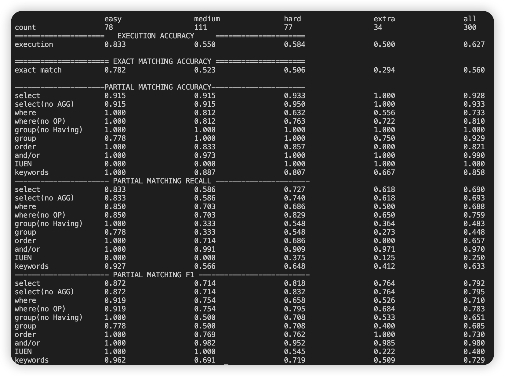

source /Users/yangenhui/code/Github/spider/.venv/bin/activate
(base) yangenhui@MacBook-Air-82 spider % source /Users/yangenhui/code/Github/spider/.venv/bin/activate
(.venv) (base) yangenhui@MacBook-Air-82 spider % python evaluation.py --gold a.sql --pred b.sql --etype all --db spider_data/test_database --table spider_data/test_tables.json
eval_err_num:1
medium pred: SELECT Manager, Captain FROM club WHERE Name IN ('Arsenal', 'Aston Villa', 'Blackburn Rovers', 'Bolton Wanderers', 'Chelsea')
medium gold: SELECT Manager ,  Captain FROM club

hard pred: SELECT Country FROM player WHERE Wins_count > 2 ORDER BY Wins_count DESC LIMIT 1;
hard gold: SELECT Country FROM player WHERE Wins_count  >  2 ORDER BY Earnings DESC LIMIT 1

eval_err_num:2
medium pred: SELECT player.Name, club.Name FROM player JOIN club ON player.Club_ID = club.Club_ID WHERE club.Name IN ('Arsenal', 'Aston Villa', 'Blackburn Rovers', 'Bolton Wanderers', 'Chelsea') OR player.Name IN ('Nick Price', 'Paul Azinger', 'Greg Norman', 'Jim Gallagher', 'Jr.', 'David Frost');
medium gold: SELECT T2.Name ,  T1.Name FROM club AS T1 JOIN player AS T2 ON T1.Club_ID  =  T2.Club_ID

eval_err_num:3
medium pred: SELECT player.Name, club.Name FROM player JOIN club ON player.Club_ID = club.Club_ID WHERE club.Name IN ('Arsenal', 'Aston Villa', 'Blackburn Rovers', 'Bolton Wanderers', 'Chelsea') OR player.Name IN ('Nick Price', 'Paul Azinger', 'Greg Norman');
medium gold: SELECT T2.Name ,  T1.Name FROM club AS T1 JOIN player AS T2 ON T1.Club_ID  =  T2.Club_ID

eval_err_num:4
medium pred: SELECT player.Name FROM player INNER JOIN club ON player.Club_ID = club.Club_ID WHERE club.Manager = 'Sam Allardyce';
medium gold: SELECT T2.Name FROM club AS T1 JOIN player AS T2 ON T1.Club_ID  =  T2.Club_ID WHERE T1.Manager  =  "Sam Allardyce"

hard pred: SELECT club.Name FROM club JOIN player ON club.Club_ID = player.Club_ID ORDER BY player.Earnings DESC;
hard gold: SELECT T1.Name FROM club AS T1 JOIN player AS T2 ON T1.Club_ID  =  T2.Club_ID GROUP BY T1.Club_ID ORDER BY avg(T2.Earnings) DESC

eval_err_num:5
hard pred: SELECT club.Name, AVG(player.Earnings) AS avg_earnings FROM club JOIN player ON club.Club_ID = player.Club_ID GROUP BY club.Club_ID ORDER BY avg_earnings DESC;
hard gold: SELECT T1.Name FROM club AS T1 JOIN player AS T2 ON T1.Club_ID  =  T2.Club_ID GROUP BY T1.Club_ID ORDER BY avg(T2.Earnings) DESC

eval_err_num:6
medium pred: SELECT Manufacturer, COUNT(Club_ID) AS clubs FROM club GROUP BY Manufacturer;
medium gold: SELECT Manufacturer ,  COUNT(*) FROM club GROUP BY Manufacturer

eval_err_num:7
hard pred: SELECT Manufacturer, COUNT(*) AS count FROM club GROUP BY Manufacturer ORDER BY count DESC LIMIT 1;
hard gold: SELECT Manufacturer FROM club GROUP BY Manufacturer ORDER BY COUNT(*) DESC LIMIT 1

easy pred: SELECT Manufacturer FROM club GROUP BY Manufacturer HAVING COUNT(DISTINCT Club_ID) > 1;
easy gold: SELECT Manufacturer FROM club GROUP BY Manufacturer HAVING COUNT(*)  >  1

easy pred: SELECT Country FROM player GROUP BY Country HAVING COUNT(Player_ID) > 1;
easy gold: SELECT Country FROM player GROUP BY Country HAVING COUNT(*)  >  1

hard pred: SELECT Name FROM club WHERE Club_ID NOT IN (SELECT DISTINCT Club_ID FROM player);
hard gold: SELECT Name FROM club WHERE Club_ID NOT IN (SELECT Club_ID FROM player)

hard pred: SELECT Name FROM club WHERE Club_ID NOT IN (SELECT DISTINCT Club_ID FROM player);
hard gold: SELECT Name FROM club WHERE Club_ID NOT IN (SELECT Club_ID FROM player)

hard pred: SELECT Country FROM player WHERE Earnings > 1400000 OR Earnings < 1100000;
hard gold: SELECT Country FROM player WHERE Earnings  >  1400000 INTERSECT SELECT Country FROM player WHERE Earnings  <  1100000

eval_err_num:8
medium pred: SELECT Earnings FROM player WHERE Country IN ('Australia', 'Zimbabwe')
medium gold: SELECT Earnings FROM player WHERE Country  =  "Australia" OR Country  =  "Zimbabwe"

extra pred: SELECT Customers.customer_id, Customers.customer_first_name, Customers.customer_last_name FROM Customers JOIN Orders ON Customers.customer_id = Orders.customer_id JOIN Order_Items ON Orders.order_id = Order_Items.order_id GROUP BY Customers.customer_id HAVING COUNT(Orders.order_id) > 2 AND COUNT(Order_Items.order_item_id) >= 3;
extra gold: SELECT T1.customer_id ,  T1.customer_first_name ,  T1.customer_last_name FROM Customers AS T1 JOIN Orders AS T2 ON T1.customer_id  =  T2.customer_id GROUP BY T1.customer_id HAVING count(*)  >  2 INTERSECT SELECT T1.customer_id ,  T1.customer_first_name ,  T1.customer_last_name FROM Customers AS T1 JOIN Orders AS T2 ON T1.customer_id  =  T2.customer_id JOIN Order_items AS T3 ON T2.order_id  =  T3.order_id GROUP BY T1.customer_id HAVING count(*)  >= 3

eval_err_num:9
extra pred: SELECT Customers.customer_id, Customers.customer_first_name, Customers.customer_last_name FROM Customers JOIN Orders ON Customers.customer_id = Orders.customer_id JOIN Order_Items ON Orders.order_id = Order_Items.order_id GROUP BY Customers.customer_id HAVING COUNT(Orders.order_id) > 2 AND SUM(CASE WHEN Order_Items.order_item_status_code = 'Delivered' THEN 1 ELSE 0 END) >= 3;
extra gold: SELECT T1.customer_id ,  T1.customer_first_name ,  T1.customer_last_name FROM Customers AS T1 JOIN Orders AS T2 ON T1.customer_id  =  T2.customer_id GROUP BY T1.customer_id HAVING count(*)  >  2 INTERSECT SELECT T1.customer_id ,  T1.customer_first_name ,  T1.customer_last_name FROM Customers AS T1 JOIN Orders AS T2 ON T1.customer_id  =  T2.customer_id JOIN Order_items AS T3 ON T2.order_id  =  T3.order_id GROUP BY T1.customer_id HAVING count(*)  >= 3

eval_err_num:10
medium pred: SELECT Orders.order_id, Orders.order_status_code, COUNT(Order_Items.product_id) AS product_count FROM Orders JOIN Order_Items ON Orders.order_id = Order_Items.order_id GROUP BY Orders.order_id, Orders.order_status_code;
medium gold: SELECT T1.order_id ,  T1.order_status_code ,  count(*) FROM Orders AS T1 JOIN Order_items AS T2 ON T1.order_id  =  T2.order_id GROUP BY T1.order_id

eval_err_num:11
medium pred: SELECT Orders.order_id, COUNT(Order_Items.order_item_id) AS product_count, Orders.order_status_code FROM Orders JOIN Order_Items ON Orders.order_id = Order_Items.order_id GROUP BY Orders.order_id;
medium gold: SELECT T1.order_id ,  T1.order_status_code ,  count(*) FROM Orders AS T1 JOIN Order_items AS T2 ON T1.order_id  =  T2.order_id GROUP BY T1.order_id

hard pred: SELECT DISTINCT date_order_placed FROM Orders WHERE date_order_placed = (SELECT MIN(date_order_placed) FROM Orders) OR order_id IN (SELECT order_id FROM Order_Items GROUP BY order_id HAVING COUNT(*) > 1);
hard gold: SELECT min(date_order_placed) FROM Orders UNION SELECT T1.date_order_placed FROM Orders AS T1 JOIN Order_items AS T2 ON T1.order_id  =  T2.order_id GROUP BY T1.order_id HAVING count(*)  >  1

eval_err_num:12
hard pred: SELECT MIN(date_order_placed) AS earliest_order_date FROM Orders WHERE order_status_code IN ('Cancelled', 'Part Completed', 'Delivered', 'Out of Stock') GROUP BY order_id HAVING COUNT(*) > 1 UNION SELECT date_order_placed FROM Orders WHERE order_id IN (SELECT order_id FROM Order_Items GROUP BY order_id HAVING COUNT(*) > 1) AND order_status_code IN ('Cancelled', 'Part Completed', 'Delivered', 'Out of Stock') ORDER BY date_order_placed;
hard gold: SELECT min(date_order_placed) FROM Orders UNION SELECT T1.date_order_placed FROM Orders AS T1 JOIN Order_items AS T2 ON T1.order_id  =  T2.order_id GROUP BY T1.order_id HAVING count(*)  >  1

extra pred: SELECT customer_first_name, customer_middle_initial, customer_last_name FROM Customers WHERE customer_id NOT IN (SELECT customer_id FROM Orders);
extra gold: SELECT customer_first_name ,  customer_middle_initial ,  customer_last_name FROM Customers EXCEPT SELECT T1.customer_first_name ,  T1.customer_middle_initial ,  T1.customer_last_name FROM Customers AS T1 JOIN Orders AS T2 ON T1.customer_id  =  T2.customer_id

eval_err_num:13
extra pred: SELECT customer_first_name, customer_middle_initial, customer_last_name FROM Customers LEFT JOIN Orders ON Customers.customer_id = Orders.customer_id WHERE Orders.order_id IS NULL;
extra gold: SELECT customer_first_name ,  customer_middle_initial ,  customer_last_name FROM Customers EXCEPT SELECT T1.customer_first_name ,  T1.customer_middle_initial ,  T1.customer_last_name FROM Customers AS T1 JOIN Orders AS T2 ON T1.customer_id  =  T2.customer_id

extra pred: SELECT product_id, product_name, product_price, product_color FROM Products WHERE product_id NOT IN (SELECT product_id FROM Order_Items WHERE order_item_status_code = 'Cancelled' OR order_item_status_code = 'Part Completed' OR order_item_status_code = 'Delivered' GROUP BY product_id HAVING COUNT(*) >= 2) ORDER BY product_id;
extra gold: SELECT product_id ,  product_name ,  product_price ,  product_color FROM Products EXCEPT SELECT T1.product_id ,  T1.product_name ,  T1.product_price ,  T1.product_color FROM Products AS T1 JOIN Order_items AS T2 ON T1.product_id  =  T2.product_id JOIN Orders AS T3 ON T2.order_id  =  T3.order_id GROUP BY T1.product_id HAVING count(*)  >=  2

hard pred: SELECT product_id, product_name, product_price, product_color FROM Products WHERE product_id NOT IN (SELECT DISTINCT product_id FROM Order_Items WHERE order_id IN (SELECT order_id FROM Orders WHERE order_status_code = 'Cancelled' OR order_status_code = 'Part Completed' OR order_status_code = 'Delivered')) AND product_id IN (SELECT product_id FROM Order_Items);
hard gold: select t1.product_id ,  t1.product_name ,  t1.product_price ,  t1.product_color from products as t1 join order_items as t2 on t1.product_id  =  t2.product_id join orders as t3 on t2.order_id  =  t3.order_id group by t1.product_id having count(*) < 2

medium pred: SELECT order_id, date_order_placed FROM Orders WHERE order_id IN (SELECT order_id FROM Order_Items GROUP BY order_id HAVING COUNT(*) >= 2);
medium gold: SELECT T1.order_id ,  T1.date_order_placed FROM Orders AS T1 JOIN Order_items AS T2 ON T1.order_id  =  T2.order_id GROUP BY T1.order_id HAVING count(*)  >=  2

extra pred: SELECT Products.product_id, Products.product_name, Products.product_price FROM Products JOIN Order_Items ON Products.product_id = Order_Items.product_id GROUP BY Products.product_id ORDER BY COUNT(Order_Items.order_id) DESC LIMIT 1;
extra gold: SELECT T1.product_id ,  T1.product_name ,  T1.product_price FROM Products AS T1 JOIN Order_items AS T2 ON T1.product_id  =  T2.product_id GROUP BY T1.product_id ORDER BY count(*) DESC LIMIT 1

extra pred: SELECT Products.product_id, Products.product_name, Products.product_price FROM Products JOIN Order_Items ON Products.product_id = Order_Items.product_id WHERE Order_Items.order_item_status_code = 'Delivered' GROUP BY Products.product_id ORDER BY COUNT(Order_Items.order_item_id) DESC;
extra gold: SELECT T1.product_id ,  T1.product_name ,  T1.product_price FROM Products AS T1 JOIN Order_items AS T2 ON T1.product_id  =  T2.product_id GROUP BY T1.product_id ORDER BY count(*) DESC LIMIT 1

eval_err_num:14
extra pred: SELECT order_id, SUM(product_price) AS total_price FROM Order_Items JOIN Products ON Order_Items.product_id = Products.product_id WHERE product_name IN ('Dell monitor', 'Dell keyboard', 'iPhone6s', 'iWatch', 'Lenovo keyboard') AND order_item_status_code IN ('Cancelled', 'Part Completed', 'Delivered') GROUP BY order_id ORDER BY total_price ASC LIMIT 1;
extra gold: SELECT T1.order_id ,  sum(T2.product_price) FROM Order_items AS T1 JOIN Products AS T2 ON T1.product_id  =  T2.product_id GROUP BY T1.order_id ORDER BY sum(T2.product_price) ASC LIMIT 1

eval_err_num:15
extra pred: SELECT Orders.order_id, SUM(Products.product_price) AS total_cost FROM Orders JOIN Order_Items ON Orders.order_id = Order_Items.order_id JOIN Products ON Order_Items.product_id = Products.product_id WHERE Orders.order_status_code IN ('Cancelled', 'Part Completed', 'Delivered') GROUP BY Orders.order_id ORDER BY total_cost ASC LIMIT 1;
extra gold: select t1.order_id ,  sum(t2.product_price) from order_items as t1 join products as t2 on t1.product_id  =  t2.product_id group by t1.order_id order by sum(t2.product_price) asc limit 1

hard pred: SELECT Customers.gender_code, COUNT(Order_Items.order_item_id) FROM Customers JOIN Orders ON Customers.customer_id = Orders.customer_id JOIN Order_Items ON Orders.order_id = Order_Items.order_id GROUP BY Customers.gender_code;
hard gold: SELECT T1.gender_code ,  count(*) FROM Customers AS T1 JOIN Orders AS T2 ON T1.customer_id  =  T2.customer_id JOIN Order_items AS T3 ON T2.order_id  =  T3.order_id GROUP BY T1.gender_code

hard pred: SELECT Customers.gender_code, COUNT(Order_Items.order_item_id) FROM Customers JOIN Orders ON Customers.customer_id = Orders.customer_id JOIN Order_Items ON Orders.order_id = Order_Items.order_id GROUP BY Customers.gender_code;
hard gold: SELECT T1.gender_code ,  count(*) FROM Customers AS T1 JOIN Orders AS T2 ON T1.customer_id  =  T2.customer_id JOIN Order_items AS T3 ON T2.order_id  =  T3.order_id GROUP BY T1.gender_code

eval_err_num:16
medium pred: SELECT COUNT(*) AS order_count, Customers.gender_code FROM Orders JOIN Customers ON Orders.customer_id = Customers.customer_id GROUP BY Customers.gender_code;
medium gold: SELECT T1.gender_code ,  count(*) FROM Customers AS T1 JOIN Orders AS T2 ON T1.customer_id  =  T2.customer_id GROUP BY T1.gender_code

medium pred: SELECT Customers.gender_code, COUNT(Orders.order_id) FROM Customers JOIN Orders ON Customers.customer_id = Orders.customer_id GROUP BY Customers.gender_code;
medium gold: SELECT T1.gender_code ,  count(*) FROM Customers AS T1 JOIN Orders AS T2 ON T1.customer_id  =  T2.customer_id GROUP BY T1.gender_code

eval_err_num:17
medium pred: SELECT Customers.customer_first_name, Customers.customer_middle_initial, Customers.customer_last_name, Customer_Payment_Methods.payment_method_code FROM Customers LEFT JOIN Customer_Payment_Methods ON Customers.customer_id = Customer_Payment_Methods.customer_id;
medium gold: SELECT T1.customer_first_name ,  T1.customer_middle_initial ,  T1.customer_last_name ,  T2.Payment_method_code FROM Customers AS T1 JOIN Customer_Payment_Methods AS T2 ON T1.customer_id  =  T2.customer_id

eval_err_num:18
medium pred: SELECT Invoices.invoice_status_code, Invoices.invoice_date, Shipments.shipment_date FROM Invoices JOIN Shipments ON Invoices.invoice_number = Shipments.invoice_number WHERE Invoices.invoice_number IN (6900, 3499, 5617, 6074, 3848) UNION SELECT Invoices.invoice_status_code, Invoices.invoice_date, NULL AS shipment_date FROM Invoices WHERE Invoices.invoice_number NOT IN (SELECT Shipments.invoice_number FROM Shipments WHERE Shipments.invoice_number IN (6900, 3499, 5617, 6074, 3848));
medium gold: SELECT T1.invoice_status_code ,  T1.invoice_date ,  T2.shipment_date FROM Invoices AS T1 JOIN Shipments AS T2 ON T1.invoice_number  =  T2.invoice_number

hard pred: SELECT Products.product_name, Shipments.shipment_date FROM Products JOIN Order_Items ON Products.product_id = Order_Items.product_id JOIN Shipments ON Order_Items.order_id = Shipments.order_id;
hard gold: SELECT T1.product_name ,  T4.shipment_date FROM Products AS T1 JOIN Order_items AS T2 ON T1.product_id  =  T2.product_id JOIN Shipment_Items AS T3 ON T2.order_item_id  =  T3.order_item_id JOIN Shipments AS T4 ON T3.shipment_id  =  T4.shipment_id

eval_err_num:19
hard pred: SELECT DISTINCT Products.product_name, Shipments.shipment_date FROM Products JOIN Shipments ON Products.product_id = Shipments.order_id WHERE Products.product_name IN ('Dell monitor', 'Dell keyboard', 'iPhone6s', 'iWatch', 'Lenovo keyboard');
hard gold: SELECT T1.product_name ,  T4.shipment_date FROM Products AS T1 JOIN Order_items AS T2 ON T1.product_id  =  T2.product_id JOIN Shipment_Items AS T3 ON T2.order_item_id  =  T3.order_item_id JOIN Shipments AS T4 ON T3.shipment_id  =  T4.shipment_id

eval_err_num:20
medium pred: SELECT Order_Items.order_item_status_code, Shipments.shipment_tracking_number FROM Order_Items JOIN Shipments ON Order_Items.order_id = Shipments.order_id WHERE Order_Items.order_item_status_code IN ('Delivered', 'Out of Stock') AND Shipments.shipment_tracking_number IN ('6900', '3499', '5617', '6074', '3848');
medium gold: SELECT T1.order_item_status_code ,  T3.shipment_tracking_number FROM Order_items AS T1 JOIN Shipment_Items AS T2 ON T1.order_item_id  =  T2.order_item_id JOIN Shipments AS T3 ON T2.shipment_id  =  T3.shipment_id

eval_err_num:21
medium pred: SELECT Orders.order_status_code, Shipments.shipment_tracking_number FROM Orders JOIN Order_Items ON Orders.order_id = Order_Items.order_id JOIN Shipments ON Orders.order_id = Shipments.order_id WHERE Orders.order_status_code IN ('Cancelled', 'Part Completed', 'Delivered', 'Out of Stock') AND Order_Items.order_item_status_code IN ('Cancelled', 'Part Completed', 'Delivered', 'Out of Stock');
medium gold: SELECT T1.order_item_status_code ,  T3.shipment_tracking_number FROM Order_items AS T1 JOIN Shipment_Items AS T2 ON T1.order_item_id  =  T2.order_item_id JOIN Shipments AS T3 ON T2.shipment_id  =  T3.shipment_id

eval_err_num:22
hard pred: SELECT Products.product_name, Products.product_color FROM Products JOIN Order_Items ON Products.product_id = Order_Items.product_id JOIN Orders ON Order_Items.order_id = Orders.order_id JOIN Shipments ON Orders.order_id = Shipments.order_id WHERE Products.product_name IN ('Dell monitor', 'Dell keyboard', 'iPhone6s', 'iWatch', 'Lenovo keyboard') AND Orders.order_status_code = 'Cancelled' AND Shipments.shipment_date IS NOT NULL;
hard gold: SELECT T1.product_name ,  T1.product_color FROM Products AS T1 JOIN Order_items AS T2 ON T1.product_id  =  T2.product_id JOIN Shipment_Items AS T3 ON T2.order_item_id  =  T3.order_item_id JOIN Shipments AS T4 ON T3.shipment_id  =  T4.shipment_id

hard pred: SELECT Products.product_name, Products.product_color FROM Products JOIN Order_Items ON Products.product_id = Order_Items.product_id JOIN Orders ON Order_Items.order_id = Orders.order_id WHERE Orders.order_status_code = 'shipped' AND Order_Items.order_item_status_code = 'shipped'
hard gold: SELECT T1.product_name ,  T1.product_color FROM Products AS T1 JOIN Order_items AS T2 ON T1.product_id  =  T2.product_id JOIN Shipment_Items AS T3 ON T2.order_item_id  =  T3.order_item_id JOIN Shipments AS T4 ON T3.shipment_id  =  T4.shipment_id

eval_err_num:23
extra pred: SELECT DISTINCT p.product_name, p.product_price, p.product_description FROM Products p JOIN Order_Items oi ON p.product_id = oi.product_id JOIN Orders o ON oi.order_id = o.order_id JOIN Customers c ON o.customer_id = c.customer_id WHERE c.gender_code = 'Female';
extra gold: SELECT DISTINCT T1.product_name ,  T1.product_price ,  T1.product_description FROM Products AS T1 JOIN Order_items AS T2 ON T1.product_id  =  T2.product_id JOIN Orders AS T3 ON T2.order_id  =  T3.order_id JOIN Customers AS T4 ON T3.customer_id  =  T4.customer_id WHERE T4.gender_code  =  'Female'

eval_err_num:24
extra pred: SELECT DISTINCT Products.product_name, Products.product_price, Products.product_description FROM Products JOIN Order_Items ON Products.product_id = Order_Items.product_id JOIN Orders ON Order_Items.order_id = Orders.order_id JOIN Customers ON Orders.customer_id = Customers.customer_id WHERE LOWER(Customers.gender_code) = 'female'
extra gold: SELECT DISTINCT T1.product_name ,  T1.product_price ,  T1.product_description FROM Products AS T1 JOIN Order_items AS T2 ON T1.product_id  =  T2.product_id JOIN Orders AS T3 ON T2.order_id  =  T3.order_id JOIN Customers AS T4 ON T3.customer_id  =  T4.customer_id WHERE T4.gender_code  =  'Female'

hard pred: SELECT invoice_status_code FROM Invoices WHERE invoice_number IN (SELECT invoice_number FROM Shipments WHERE order_id NOT IN (SELECT order_id FROM Orders WHERE order_status_code = 'Shipped'))
hard gold: SELECT invoice_status_code FROM Invoices WHERE invoice_number NOT IN ( SELECT invoice_number FROM Shipments )

eval_err_num:25
hard pred: SELECT Orders.order_id, Orders.date_order_placed, SUM(Products.product_price) AS total_cost FROM Orders JOIN Order_Items ON Orders.order_id = Order_Items.order_id JOIN Products ON Order_Items.product_id = Products.product_id WHERE Products.product_name IN ('Dell monitor', 'Dell keyboard', 'iPhone6s', 'iWatch', 'Lenovo keyboard') AND Orders.order_status_code IN ('Cancelled', 'Part Completed', 'Delivered') GROUP BY Orders.order_id, Orders.date_order_placed;
hard gold: select t1.order_id ,  t1.date_order_placed ,  sum(t3.product_price) from orders as t1 join order_items as t2 on t1.order_id  =  t2.order_id join products as t3 on t2.product_id  =  t3.product_id group by t1.order_id

hard pred: SELECT Orders.order_id, Orders.date_order_placed, Invoices.invoice_number, Invoices.invoice_date, Invoices.invoice_status_code FROM Orders JOIN Invoices ON Orders.order_id = Invoices.invoice_number;
hard gold: SELECT T1.order_id ,  T1.date_order_placed ,  sum(T3.product_price) FROM Orders AS T1 JOIN Order_items AS T2 ON T1.order_id  =  T2.order_id JOIN Products AS T3 ON T2.product_id  =  T3.product_id GROUP BY T1.order_id

easy pred: SELECT COUNT(DISTINCT Orders.customer_id) FROM Orders JOIN Customers ON Orders.customer_id = Customers.customer_id;
easy gold: SELECT count(DISTINCT customer_id) FROM Orders

easy pred: SELECT COUNT(DISTINCT Orders.customer_id) FROM Orders JOIN Customers ON Orders.customer_id = Customers.customer_id;
easy gold: SELECT count(DISTINCT customer_id) FROM Orders

easy pred: SELECT COUNT(DISTINCT order_status_code) FROM Orders;
easy gold: SELECT count(DISTINCT order_item_status_code) FROM Order_items

eval_err_num:26
extra pred: SELECT COUNT(DISTINCT p.product_id) FROM Products p LEFT JOIN Order_Items oi ON p.product_id = oi.product_id WHERE oi.order_item_id IS NULL;
extra gold: SELECT count(*) FROM Products WHERE product_id NOT IN ( SELECT product_id FROM Order_items )

eval_err_num:27
extra pred: SELECT COUNT(*) FROM Customers LEFT JOIN Customer_Payment_Methods ON Customers.customer_id = Customer_Payment_Methods.customer_id WHERE Customer_Payment_Methods.payment_method_code IS NULL;
extra gold: SELECT count(*) FROM Customers WHERE customer_id NOT IN ( SELECT customer_id FROM Customer_Payment_Methods )

eval_err_num:28
hard pred: SELECT Customers.customer_first_name, Products.product_name FROM Customers JOIN Orders ON Customers.customer_id = Orders.customer_id JOIN Order_Items ON Orders.order_id = Order_Items.order_id JOIN Products ON Order_Items.product_id = Products.product_id WHERE Customers.gender_code IN ('Female', 'Male', 'Unknown') AND Products.product_name IN ('Dell monitor', 'Dell keyboard', 'iPhone6s', 'iWatch', 'Lenovo keyboard') ORDER BY Customers.customer_first_name;
hard gold: SELECT T1.customer_first_name ,  T4.product_name FROM Customers AS T1 JOIN Orders AS T2 ON T1.customer_id  =  T2.customer_id JOIN Order_items AS T3 ON T2.order_id  =  T3.order_id JOIN Products AS T4 ON T3.product_id  =  T4.product_id

easy pred: SELECT COUNT(DISTINCT order_item_id) FROM Shipment_Items;
easy gold: SELECT count(*) FROM Shipment_Items

easy pred: SELECT COUNT(DISTINCT order_id) FROM Shipments;
easy gold: SELECT count(*) FROM Shipment_Items

eval_err_num:29
easy pred: SELECT AVG(product_price) FROM Products JOIN Order_Items ON Products.product_id = Order_Items.product_id WHERE product_name IN ('Dell monitor', 'Dell keyboard', 'iPhone6s', 'iWatch', 'Lenovo keyboard');
easy gold: SELECT avg(T1.product_price) FROM Products AS T1 JOIN Order_items AS T2 ON T1.product_id  =  T2.product_id

eval_err_num:30
easy pred: SELECT AVG(product_price) FROM Products JOIN Order_Items ON Products.product_id = Order_Items.product_id WHERE product_name IN ('Dell monitor', 'Dell keyboard', 'iPhone6s', 'iWatch', 'Lenovo keyboard') AND order_item_status_code = 'Delivered';
easy gold: SELECT avg(T1.product_price) FROM Products AS T1 JOIN Order_items AS T2 ON T1.product_id  =  T2.product_id

extra pred: SELECT email_address, town_city, county FROM Customers WHERE gender_code IN (SELECT gender_code FROM Customers GROUP BY gender_code HAVING COUNT(*) < (SELECT COUNT(*) FROM Orders WHERE Orders.customer_id = Customers.customer_id));
extra gold: SELECT email_address ,  town_city ,  county FROM Customers WHERE gender_code  =  ( SELECT gender_code FROM Customers GROUP BY gender_code ORDER BY count(*) ASC LIMIT 1 )

hard pred: SELECT date_order_placed FROM Orders WHERE customer_id IN (SELECT customer_id FROM Customer_Payment_Methods GROUP BY customer_id HAVING COUNT(DISTINCT payment_method_code) >= 2)
hard gold: SELECT date_order_placed FROM Orders WHERE customer_id IN ( SELECT T1.customer_id FROM Customers AS T1 JOIN Customer_Payment_Methods AS T2 ON T1.customer_id  =  T2.customer_id GROUP BY T1.customer_id HAVING count(*)  >=  2 )

hard pred: SELECT DISTINCT date_order_placed FROM Orders WHERE customer_id IN (SELECT customer_id FROM Customer_Payment_Methods GROUP BY customer_id HAVING COUNT(DISTINCT payment_method_code) >= 2);
hard gold: SELECT date_order_placed FROM Orders WHERE customer_id IN ( SELECT T1.customer_id FROM Customers AS T1 JOIN Customer_Payment_Methods AS T2 ON T1.customer_id  =  T2.customer_id GROUP BY T1.customer_id HAVING count(*)  >=  2 )

medium pred: SELECT invoice_number, invoice_date FROM Invoices WHERE invoice_number IN (SELECT invoice_number FROM Shipments GROUP BY invoice_number HAVING COUNT(*) >= 2) ORDER BY invoice_date;
medium gold: SELECT T1.invoice_date ,  T1.invoice_number FROM Invoices AS T1 JOIN Shipments AS T2 ON T1.invoice_number  =  T2.invoice_number GROUP BY T1.invoice_number HAVING count(*)  >=  2

extra pred: SELECT product_color, product_description, product_size FROM Products WHERE product_price < (SELECT MAX(product_price) FROM Products)
extra gold: select product_color ,  product_description ,  product_size from products where product_price  !=  ( select max(product_price) from products )

medium pred: SELECT Name FROM director ORDER BY Age ASC LIMIT 1;
medium gold: SELECT name FROM director ORDER BY age DESC LIMIT 1

eval_err_num:31
extra pred: SELECT Name, COUNT(*) as num_programs FROM director JOIN program ON director.Director_ID = program.Director_ID GROUP BY Name ORDER BY num_programs DESC LIMIT 1;
extra gold: SELECT t2.name FROM program AS t1 JOIN director AS t2 ON t1.director_id  =  t2.director_id GROUP BY t1.director_id ORDER BY count(*) DESC LIMIT 1

eval_err_num:32
extra pred: SELECT d.Name, d.Age FROM director d JOIN program p ON d.Director_ID = p.Director_ID GROUP BY d.Director_ID ORDER BY COUNT(p.Program_ID) DESC LIMIT 1;
extra gold: SELECT t2.name ,  t2.age FROM program AS t1 JOIN director AS t2 ON t1.director_id  =  t2.director_id GROUP BY t1.director_id ORDER BY count(*) DESC LIMIT 1

medium pred: SELECT Name, Internet FROM channel WHERE Channel_ID IN (SELECT Channel_ID FROM program GROUP BY Channel_ID HAVING COUNT(Program_ID) > 1)
medium gold: SELECT t1.name ,  t1.internet FROM channel AS t1 JOIN program AS t2 ON t1.channel_id  =  t2.channel_id GROUP BY t1.channel_id HAVING count(*)  >  1

eval_err_num:33
medium pred: SELECT channel.Name, COUNT(program.Program_ID) AS Number_of_Programs FROM channel JOIN program ON channel.Channel_ID = program.Channel_ID GROUP BY channel.Channel_ID;
medium gold: SELECT t1.name ,  count(*) FROM channel AS t1 JOIN program AS t2 ON t1.channel_id  =  t2.channel_id GROUP BY t1.channel_id

extra pred: SELECT COUNT(*) FROM channel WHERE Channel_ID NOT IN (SELECT DISTINCT Channel_ID FROM program);
extra gold: SELECT count(*) FROM channel WHERE channel_id NOT IN (SELECT channel_id FROM program)

eval_err_num:34
medium pred: SELECT d.Name FROM director d JOIN program p ON d.Director_ID = p.Director_ID WHERE p.Title = 'Dracula'
medium gold: SELECT t2.name FROM program AS t1 JOIN director AS t2 ON t1.director_id  =  t2.director_id WHERE t1.title  =  'Dracula'

eval_err_num:35
extra pred: SELECT c.Name, c.Internet FROM channel c JOIN director_admin da ON c.Channel_ID = da.Channel_ID GROUP BY c.Channel_ID ORDER BY COUNT(DISTINCT da.Director_ID) DESC LIMIT 1;
extra gold: SELECT t1.name ,  t1.internet FROM channel AS t1 JOIN director_admin AS t2 ON t1.channel_id  =  t2.channel_id GROUP BY t1.channel_id ORDER BY count(*) DESC LIMIT 1

hard pred: SELECT Channel_ID, Name FROM channel WHERE Channel_ID NOT IN (SELECT Channel_ID FROM director_admin WHERE Director_ID = (SELECT Director_ID FROM director WHERE Name = 'Hank Baskett'));
hard gold: SELECT t1.name ,  t1.channel_id FROM channel AS t1 JOIN director_admin AS t2 ON t1.channel_id  =  t2.channel_id JOIN director AS t3 ON t2.director_id  =  t3.director_id WHERE t3.name != "Hank Baskett"

eval_err_num:36
easy pred: SELECT Station_name FROM city_channel WHERE Affiliation != 'ABC' AND City IN ('Phoenix', 'Bakersfield', 'San Diego', 'Colorado Springs', 'Denver') AND ID IN (SELECT City_channel_ID FROM city_channel_radio UNION SELECT City_channel_ID FROM city_channel_tv_show);
easy gold: SELECT Station_name FROM city_channel WHERE Affiliation != "ABC"

eval_err_num:37
medium pred: SELECT Transmitter FROM radio ORDER BY CAST(ERP_kW AS NUMBER) DESC LIMIT 1;
medium gold: SELECT Transmitter FROM radio ORDER BY ERP_kW DESC LIMIT 1

medium pred: SELECT Affiliation, COUNT(ID) FROM city_channel GROUP BY Affiliation;
medium gold: SELECT Affiliation ,  COUNT(*) FROM city_channel GROUP BY Affiliation

eval_err_num:38
medium pred: SELECT city_channel.City, radio.Transmitter FROM city_channel JOIN city_channel_radio ON city_channel.ID = city_channel_radio.City_channel_ID JOIN radio ON city_channel_radio.Radio_ID = radio.Radio_ID WHERE city_channel.City IN ('Phoenix', 'Bakersfield', 'California', 'San Diego', 'Colorado Springs', 'Colorado', 'Denver', 'Cairn Hill');
medium gold: SELECT T3.Transmitter ,  T2.City FROM city_channel_radio AS T1 JOIN city_channel AS T2 ON T1.City_channel_ID  =  T2.ID JOIN radio AS T3 ON T1.Radio_ID  =  T3.Radio_ID

eval_err_num:39
medium pred: SELECT radio.Transmitter, COUNT(city_channel_radio.City_channel_ID) AS city_channels_count FROM radio JOIN city_channel_radio ON radio.Radio_ID = city_channel_radio.Radio_ID GROUP BY radio.Transmitter;
medium gold: SELECT T2.Transmitter ,  COUNT(*) FROM city_channel_radio AS T1 JOIN radio AS T2 ON T1.Radio_ID  =  T2.Radio_ID GROUP BY T2.Transmitter

eval_err_num:40
hard pred: SELECT COUNT(Vehicle_ID) AS max_vehicles, Driver_ID FROM vehicle_driver GROUP BY Driver_ID ORDER BY max_vehicles DESC LIMIT 1;
hard gold: SELECT count(*) ,  driver_id FROM vehicle_driver GROUP BY driver_id ORDER BY count(*) DESC LIMIT 1

eval_err_num:41
hard pred: SELECT Driver_ID, COUNT(*) AS Vehicle_Count FROM vehicle_driver GROUP BY Driver_ID ORDER BY Vehicle_Count DESC LIMIT 1;
hard gold: SELECT count(*) ,  driver_id FROM vehicle_driver GROUP BY driver_id ORDER BY count(*) DESC LIMIT 1

eval_err_num:42
medium pred: SELECT MAX(Power) AS Max_Power, AVG(Power) AS Avg_Power FROM vehicle WHERE Builder = 'Zhuzhou';
medium gold: SELECT max(power) ,  avg(power) FROM vehicle WHERE builder  =  'Zhuzhou'

eval_err_num:43
hard pred: SELECT v.Vehicle_ID FROM vehicle_driver vd JOIN vehicle v ON vd.Vehicle_ID = v.Vehicle_ID GROUP BY v.Vehicle_ID ORDER BY COUNT(*) ASC LIMIT 1;
hard gold: SELECT vehicle_id FROM vehicle_driver GROUP BY vehicle_id ORDER BY count(*) ASC LIMIT 1

hard pred: SELECT Vehicle_ID FROM vehicle_driver GROUP BY Vehicle_ID ORDER BY COUNT(Driver_ID) ASC LIMIT 1;
hard gold: SELECT vehicle_id FROM vehicle_driver GROUP BY vehicle_id ORDER BY count(*) ASC LIMIT 1

eval_err_num:44
medium pred: SELECT Model,Top_Speed,Power FROM vehicle WHERE Build_Year='1996'
medium gold: SELECT top_speed ,  power FROM vehicle WHERE build_year  =  1996

eval_err_num:45
medium pred: SELECT COUNT(DISTINCT vd.Driver_ID) FROM vehicle_driver vd JOIN vehicle v ON vd.Vehicle_ID = v.Vehicle_ID WHERE v.Build_Year = '2012'
medium gold: SELECT count(DISTINCT T1.driver_id) FROM vehicle_driver AS T1 JOIN vehicle AS T2 ON T1.vehicle_id  =  T2.vehicle_id WHERE T2.build_year  =  2012

easy pred: SELECT COUNT(Driver_ID) FROM driver WHERE Racing_Series = 'NASCAR'
easy gold: SELECT count(*) FROM driver WHERE Racing_Series  =  'NASCAR'

eval_err_num:46
hard pred: SELECT Model FROM vehicle LEFT JOIN vehicle_driver ON vehicle.Vehicle_ID = vehicle_driver.Vehicle_ID WHERE vehicle_driver.Vehicle_ID IS NULL;
hard gold: SELECT model FROM vehicle EXCEPT SELECT T1.model FROM vehicle AS T1 JOIN vehicle_driver AS T2 ON T1.vehicle_id  =  T2.vehicle_id

hard pred: SELECT Model FROM vehicle WHERE Vehicle_ID NOT IN (SELECT Vehicle_ID FROM vehicle_driver);
hard gold: SELECT model FROM vehicle EXCEPT SELECT T1.model FROM vehicle AS T1 JOIN vehicle_driver AS T2 ON T1.vehicle_id  =  T2.vehicle_id

hard pred: SELECT Vehicle_ID, Model FROM vehicle WHERE Builder = 'Ziyang' OR Vehicle_ID IN (SELECT Vehicle_ID FROM vehicle_driver GROUP BY Vehicle_ID HAVING COUNT(Driver_ID) >= 2);
hard gold: SELECT T1.vehicle_id ,  T1.model FROM vehicle AS T1 JOIN vehicle_driver AS T2 ON T1.vehicle_id  =  T2.vehicle_id GROUP BY T2.vehicle_id HAVING count(*)  =  2 OR T1.builder  =  'Ziyang'

hard pred: SELECT Vehicle_ID, Model FROM vehicle WHERE Builder = 'Ziyang' OR Vehicle_ID IN (SELECT Vehicle_ID FROM vehicle_driver GROUP BY Vehicle_ID HAVING COUNT(Driver_ID) = 2);
hard gold: SELECT T1.vehicle_id ,  T1.model FROM vehicle AS T1 JOIN vehicle_driver AS T2 ON T1.vehicle_id  =  T2.vehicle_id GROUP BY T2.vehicle_id HAVING count(*)  =  2 OR T1.builder  =  'Ziyang'

extra pred: SELECT Vehicle_ID, Model FROM vehicle WHERE Vehicle_ID IN (SELECT Vehicle_ID FROM vehicle_driver GROUP BY Vehicle_ID HAVING COUNT(Driver_ID) > 2) OR Vehicle_ID IN (SELECT Vehicle_ID FROM vehicle_driver WHERE Driver_ID = (SELECT Driver_ID FROM driver WHERE Name = 'Jeff Gordon'));
extra gold: SELECT T1.vehicle_id ,  T1.model FROM vehicle AS T1 JOIN vehicle_driver AS T2 ON T1.vehicle_id  =  T2.vehicle_id JOIN driver AS T3 ON T2.driver_id  =  T3.driver_id WHERE T3.name  =  'Jeff Gordon' UNION SELECT T1.vehicle_id ,  T1.model FROM vehicle AS T1 JOIN vehicle_driver AS T2 ON T1.vehicle_id  =  T2.vehicle_id GROUP BY T2.vehicle_id HAVING count(*)  >  2

eval_err_num:47
extra pred: SELECT DISTINCT v.Vehicle_ID, v.Model FROM vehicle v JOIN vehicle_driver vd ON v.Vehicle_ID = vd.Vehicle_ID WHERE vd.Driver_ID IN (SELECT Driver_ID FROM driver WHERE Name = 'Jeff Gordon') OR (SELECT COUNT(*) FROM vehicle_driver WHERE Vehicle_ID = v.Vehicle_ID) > 2;
extra gold: SELECT T1.vehicle_id ,  T1.model FROM vehicle AS T1 JOIN vehicle_driver AS T2 ON T1.vehicle_id  =  T2.vehicle_id JOIN driver AS T3 ON T2.driver_id  =  T3.driver_id WHERE T3.name  =  'Jeff Gordon' UNION SELECT T1.vehicle_id ,  T1.model FROM vehicle AS T1 JOIN vehicle_driver AS T2 ON T1.vehicle_id  =  T2.vehicle_id GROUP BY T2.vehicle_id HAVING count(*)  >  2

medium pred: SELECT COUNT(DISTINCT vehicle_driver.Driver_ID) FROM vehicle_driver JOIN driver ON vehicle_driver.Driver_ID = driver.Driver_ID GROUP BY driver.Racing_Series;
medium gold: SELECT count(*) ,  racing_series FROM driver GROUP BY racing_series

medium pred: SELECT Racing_Series, COUNT(DISTINCT driver.Driver_ID) FROM driver JOIN vehicle_driver ON driver.Driver_ID = vehicle_driver.Driver_ID GROUP BY Racing_Series;
medium gold: SELECT count(*) ,  racing_series FROM driver GROUP BY racing_series

eval_err_num:48
hard pred: SELECT driver.Name, driver.Citizenship FROM driver INNER JOIN vehicle_driver ON driver.Driver_ID = vehicle_driver.Driver_ID INNER JOIN vehicle ON vehicle_driver.Vehicle_ID = vehicle.Vehicle_ID WHERE vehicle.Model = 'DJ1'
hard gold: SELECT T1.name ,  T1.citizenship FROM driver AS T1 JOIN vehicle_driver AS T2 ON T1.driver_id  =  T2.driver_id JOIN vehicle AS T3 ON T2.vehicle_id  =  T3.vehicle_id WHERE T3.model  =  'DJ1'

eval_err_num:49
extra pred: SELECT COUNT(*) FROM driver LEFT JOIN vehicle_driver ON driver.Driver_ID = vehicle_driver.Driver_ID WHERE vehicle_driver.Vehicle_ID IS NULL
extra gold: SELECT count(*) FROM driver WHERE driver_id NOT IN ( SELECT driver_id FROM vehicle_driver )

eval_err_num:50
medium pred: SELECT Exam_Name, Exam_Date FROM Exams WHERE Subject_Code != 'Database' AND Subject_Code IN ('Art History', 'English', 'Data Structure')
medium gold: SELECT Exam_Date ,  Exam_Name FROM Exams WHERE Subject_Code != 'Database'

eval_err_num:51
medium pred: SELECT Exam_Date, Exam_Name FROM Exams WHERE Subject_Code != 'Database' AND Subject_Code IN ('Art History', 'English', 'Data Structure')
medium gold: SELECT Exam_Date ,  Exam_Name FROM Exams WHERE Subject_Code != 'Database'

eval_err_num:52
medium pred: SELECT Q1.Type_of_Question_Code, COUNT(Q2.Question_ID) AS Count FROM Questions Q1 JOIN Questions_in_Exams Q2 ON Q1.Question_ID = Q2.Question_ID GROUP BY Q1.Type_of_Question_Code;
medium gold: SELECT Type_of_Question_Code ,  COUNT(*) FROM Questions GROUP BY Type_of_Question_Code

eval_err_num:53
medium pred: SELECT Type_of_Question_Code, COUNT(*) AS occurrence_count FROM Questions GROUP BY Type_of_Question_Code;
medium gold: SELECT Type_of_Question_Code ,  COUNT(*) FROM Questions GROUP BY Type_of_Question_Code

eval_err_num:54
easy pred: SELECT DISTINCT Student_Answers.Student_Answer_Text FROM Student_Answers JOIN Student_Assessments ON Student_Answers.Student_Answer_ID = Student_Assessments.Student_Answer_ID WHERE Student_Assessments.Assessment = 'Normal' AND Student_Answers.Student_Answer_ID IN ('ABC', 'C', 'Absent')
easy gold: SELECT DISTINCT Student_Answer_Text FROM Student_Answers WHERE Comments  =  "Normal"

eval_err_num:55
medium pred: SELECT Student_Answer_Text, COUNT(*) AS count FROM Student_Answers GROUP BY Student_Answer_Text ORDER BY count DESC;
medium gold: SELECT Student_Answer_Text FROM Student_Answers GROUP BY Student_Answer_Text ORDER BY COUNT(*) DESC

eval_err_num:56
medium pred: SELECT Student_Answer_Text, COUNT(*) AS Frequency FROM Student_Answers GROUP BY Student_Answer_Text ORDER BY Frequency DESC;
medium gold: SELECT Student_Answer_Text FROM Student_Answers GROUP BY Student_Answer_Text ORDER BY COUNT(*) DESC

eval_err_num:57
medium pred: SELECT Students.First_Name, Student_Answers.Date_of_Answer FROM Students JOIN Student_Answers ON Students.Student_ID = Student_Answers.Student_ID WHERE Students.First_Name IN ('Wilbert', 'Abdul', 'Ari', 'Cassidy', 'Alfreda', 'Normal', 'Absent')
medium gold: SELECT T2.First_Name ,  T1.Date_of_Answer FROM Student_Answers AS T1 JOIN Students AS T2 ON T1.Student_ID  =  T2.Student_ID

medium pred: SELECT Students.First_Name, Student_Answers.Date_of_Answer FROM Students JOIN Student_Answers ON Students.Student_ID = Student_Answers.Student_ID WHERE Students.First_Name = 'Wilbert' OR Students.First_Name = 'Abdul' OR Students.First_Name = 'Ari' OR Students.First_Name = 'Cassidy' OR Students.First_Name = 'Alfreda' OR Students.First_Name = 'Normal' OR Students.First_Name = 'Absent';
medium gold: SELECT T2.First_Name ,  T1.Date_of_Answer FROM Student_Answers AS T1 JOIN Students AS T2 ON T1.Student_ID  =  T2.Student_ID

medium pred: SELECT First_Name FROM Students WHERE Student_ID IN (SELECT Student_ID FROM Student_Answers GROUP BY Student_ID HAVING COUNT(*) >= 2)
medium gold: SELECT T2.First_Name FROM Student_Answers AS T1 JOIN Students AS T2 ON T1.Student_ID  =  T2.Student_ID GROUP BY T1.Student_ID HAVING COUNT(*)  >=  2

eval_err_num:58
medium pred: SELECT s.First_Name FROM Students s JOIN Student_Answers sa ON s.Student_ID = sa.Student_ID GROUP BY s.Student_ID HAVING COUNT(sa.Student_Answer_ID) >= 2;
medium gold: SELECT T2.First_Name FROM Student_Answers AS T1 JOIN Students AS T2 ON T1.Student_ID  =  T2.Student_ID GROUP BY T1.Student_ID HAVING COUNT(*)  >=  2

eval_err_num:59
medium pred: SELECT Gender_MFU, COUNT(*) AS Number_of_Students FROM Students GROUP BY Gender_MFU;
medium gold: SELECT Gender_MFU ,  COUNT(*) FROM Students GROUP BY Gender_MFU

eval_err_num:60
medium pred: SELECT Gender_MFU, COUNT(*) AS student_count FROM Students GROUP BY Gender_MFU;
medium gold: SELECT Gender_MFU ,  COUNT(*) FROM Students GROUP BY Gender_MFU

eval_err_num:61
medium pred: SELECT Last_Name FROM Students WHERE Gender_MFU IN ('F','M')
medium gold: SELECT Last_Name FROM Students WHERE Gender_MFU  =  "F" OR Gender_MFU  =  "M"

eval_err_num:62
medium pred: SELECT Last_Name FROM Students WHERE Gender_MFU IN ('F', 'M')
medium gold: SELECT Last_Name FROM Students WHERE Gender_MFU  =  "F" OR Gender_MFU  =  "M"

eval_err_num:63
hard pred: SELECT First_Name FROM Students LEFT JOIN Student_Answers ON Students.Student_ID = Student_Answers.Student_ID WHERE Student_Answers.Student_ID IS NULL;
hard gold: SELECT First_Name FROM Students WHERE Student_ID NOT IN (SELECT Student_ID FROM Student_Answers)

easy pred: SELECT Student_ID, First_Name, Middle_Name, Last_Name, Gender_MFU, Student_Address, Email_Adress, Cell_Mobile_Phone, Home_Phone FROM Students;
easy gold: SELECT * FROM Students

eval_err_num:64
easy pred: SELECT COUNT(DISTINCT product_type_code) FROM Products WHERE product_type_code IN ('hardware', 'Hardware', 'Clothes');
easy gold: SELECT count(*) FROM Products WHERE product_type_code  =  "Hardware"

medium pred: SELECT * FROM Products WHERE product_type_code = 'hardware' ORDER BY product_price ASC;
medium gold: SELECT product_name FROM Products WHERE product_type_code  =  "Hardware" ORDER BY product_price ASC

medium pred: SELECT product_type_code, COUNT(product_id) FROM Products GROUP BY product_type_code;
medium gold: SELECT product_type_code ,  count(*) FROM Products GROUP BY product_type_code

eval_err_num:65
medium pred: SELECT product_type_code, AVG(product_price) AS average_price FROM Products GROUP BY product_type_code;
medium gold: SELECT product_type_code ,  avg(product_price) FROM Products GROUP BY product_type_code

eval_err_num:66
hard pred: SELECT product_type_code, COUNT(*) AS product_count FROM Products GROUP BY product_type_code ORDER BY product_count DESC LIMIT 1;
hard gold: SELECT product_type_code FROM Products GROUP BY product_type_code ORDER BY count(*) DESC LIMIT 1

easy pred: SELECT COUNT(customer_id) FROM Customers;
easy gold: SELECT count(*) FROM Customers

eval_err_num:67
medium pred: SELECT payment_method_code, COUNT(*) AS number_of_customers FROM Customers GROUP BY payment_method_code;
medium gold: SELECT payment_method_code ,  count(*) FROM Customers GROUP BY payment_method_code

eval_err_num:68
medium pred: SELECT payment_method_code, COUNT(*) AS count FROM Customers GROUP BY payment_method_code;
medium gold: SELECT payment_method_code ,  count(*) FROM Customers GROUP BY payment_method_code

eval_err_num:69
hard pred: SELECT payment_method_code, COUNT(*) AS count FROM Customers GROUP BY payment_method_code ORDER BY count DESC LIMIT 1;
hard gold: SELECT payment_method_code FROM Customers GROUP BY payment_method_code ORDER BY count(*) DESC LIMIT 1

eval_err_num:70
hard pred: SELECT customer_name FROM Customers WHERE payment_method_code IN (SELECT payment_method_code FROM Customers GROUP BY payment_method_code HAVING COUNT(*) = (SELECT MIN(cnt) FROM (SELECT COUNT(*) AS cnt FROM Customers GROUP BY payment_method_code) AS sub))
hard gold: SELECT customer_name FROM Customers WHERE payment_method_code  =  ( SELECT payment_method_code FROM Customers GROUP BY payment_method_code ORDER BY count(*) ASC LIMIT 1)

hard pred: SELECT customer_name FROM Customers WHERE payment_method_code = 'Credit Card' OR payment_method_code = 'Direct Debit' ORDER BY payment_method_code ASC LIMIT 1;
hard gold: SELECT customer_name FROM Customers WHERE payment_method_code  =  ( SELECT payment_method_code FROM Customers GROUP BY payment_method_code ORDER BY count(*) ASC LIMIT 1)

eval_err_num:71
easy pred: SELECT DISTINCT payment_method_code FROM Customers WHERE payment_method_code IN ('Credit Card', 'Direct Debit')
easy gold: SELECT DISTINCT payment_method_code FROM Customers

eval_err_num:72
easy pred: SELECT COUNT(*) FROM Customer_Orders WHERE order_status_code IN ('Part', 'Completed')
easy gold: SELECT count(*) FROM Customer_orders

medium pred: SELECT order_id, order_date, order_status_code FROM Customer_Orders WHERE customer_id = (SELECT customer_id FROM Customers WHERE customer_name = 'Jeromy')
medium gold: SELECT order_id ,  order_date ,  order_status_code FROM Customer_orders AS T1 JOIN Customers AS T2 ON T1.customer_id  =  T2.customer_id WHERE T2.customer_name  =  "Jeromy"

eval_err_num:73
medium pred: SELECT Customers.customer_name, Customers.customer_id, COUNT(Customer_Orders.order_id) AS order_count FROM Customers LEFT JOIN Customer_Orders ON Customers.customer_id = Customer_Orders.customer_id GROUP BY Customers.customer_id;
medium gold: SELECT T2.customer_name ,  T1.customer_id ,  count(*) FROM Customer_orders AS T1 JOIN Customers AS T2 ON T1.customer_id  =  T2.customer_id GROUP BY T1.customer_id

eval_err_num:74
medium pred: SELECT Customers.customer_name, Customers.customer_id, COUNT(Customer_Orders.order_id) AS number_of_orders FROM Customers LEFT JOIN Customer_Orders ON Customers.customer_id = Customer_Orders.customer_id GROUP BY Customers.customer_id;
medium gold: SELECT T2.customer_name ,  T1.customer_id ,  count(*) FROM Customer_orders AS T1 JOIN Customers AS T2 ON T1.customer_id  =  T2.customer_id GROUP BY T1.customer_id

extra pred: SELECT customer_id, customer_name, customer_phone, customer_email FROM Customers WHERE customer_id = (SELECT customer_id FROM Customer_Orders GROUP BY customer_id ORDER BY COUNT(*) DESC LIMIT 1);
extra gold: SELECT T1.customer_id ,  T2.customer_name ,  T2.customer_phone ,  T2.customer_email FROM Customer_orders AS T1 JOIN Customers AS T2 ON T1.customer_id  =  T2.customer_id GROUP BY T1.customer_id ORDER BY count(*) DESC LIMIT 1

extra pred: SELECT Customers.customer_id, Customers.customer_name, Customers.customer_phone, Customers.customer_email FROM Customers JOIN Customer_Orders ON Customers.customer_id = Customer_Orders.customer_id GROUP BY Customers.customer_id ORDER BY COUNT(Customer_Orders.order_id) DESC LIMIT 1;
extra gold: SELECT T1.customer_id ,  T2.customer_name ,  T2.customer_phone ,  T2.customer_email FROM Customer_orders AS T1 JOIN Customers AS T2 ON T1.customer_id  =  T2.customer_id GROUP BY T1.customer_id ORDER BY count(*) DESC LIMIT 1

eval_err_num:75
medium pred: SELECT order_status_code, COUNT(*) AS order_count FROM Customer_Orders GROUP BY order_status_code;
medium gold: SELECT order_status_code ,  count(*) FROM Customer_orders GROUP BY order_status_code

eval_err_num:76
medium pred: SELECT order_status_code, COUNT(*) AS count FROM Customer_Orders GROUP BY order_status_code;
medium gold: SELECT order_status_code ,  count(*) FROM Customer_orders GROUP BY order_status_code

eval_err_num:77
hard pred: SELECT order_status_code, COUNT(*) as count FROM Customer_Orders GROUP BY order_status_code ORDER BY count DESC LIMIT 1;
hard gold: SELECT order_status_code FROM Customer_orders GROUP BY order_status_code ORDER BY count(*) DESC LIMIT 1

                     easy                 medium               hard                 extra                all                 
count                78                   111                  77                   34                   300                 
=====================   EXECUTION ACCURACY     =====================
execution            0.833                0.550                0.584                0.500                0.627               

====================== EXACT MATCHING ACCURACY =====================
exact match          0.782                0.523                0.506                0.294                0.560               

---------------------PARTIAL MATCHING ACCURACY----------------------
select               0.915                0.915                0.933                1.000                0.928               
select(no AGG)       0.915                0.915                0.950                1.000                0.933               
where                1.000                0.812                0.632                0.556                0.733               
where(no OP)         1.000                0.812                0.763                0.722                0.810               
group(no Having)     1.000                1.000                1.000                1.000                1.000               
group                0.778                1.000                1.000                0.750                0.929               
order                1.000                0.833                0.857                0.000                0.821               
and/or               1.000                0.973                1.000                1.000                0.990               
IUEN                 0.000                0.000                1.000                1.000                1.000               
keywords             1.000                0.887                0.807                0.667                0.858               
---------------------- PARTIAL MATCHING RECALL ----------------------
select               0.833                0.586                0.727                0.618                0.690               
select(no AGG)       0.833                0.586                0.740                0.618                0.693               
where                0.850                0.703                0.686                0.500                0.688               
where(no OP)         0.850                0.703                0.829                0.650                0.759               
group(no Having)     1.000                0.333                0.548                0.364                0.483               
group                0.778                0.333                0.548                0.273                0.448               
order                1.000                0.714                0.686                0.000                0.657               
and/or               1.000                0.991                0.909                0.971                0.970               
IUEN                 0.000                0.000                0.375                0.125                0.250               
keywords             0.927                0.566                0.648                0.412                0.633               
---------------------- PARTIAL MATCHING F1 --------------------------
select               0.872                0.714                0.818                0.764                0.792               
select(no AGG)       0.872                0.714                0.832                0.764                0.795               
where                0.919                0.754                0.658                0.526                0.710               
where(no OP)         0.919                0.754                0.795                0.684                0.783               
group(no Having)     1.000                0.500                0.708                0.533                0.651               
group                0.778                0.500                0.708                0.400                0.605               
order                1.000                0.769                0.762                1.000                0.730               
and/or               1.000                0.982                0.952                0.985                0.980               
IUEN                 1.000                1.000                0.545                0.222                0.400               
keywords             0.962                0.691                0.719                0.509                0.729               
