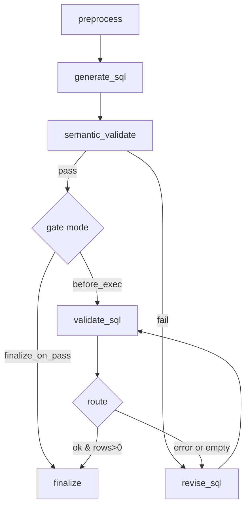

# 反向翻译验证（Back-Translation Validation）增量集成方案

参考资料：`re-act/2509.12612v1.pdf`

本方案在现有 Text-to-SQL LangGraph 智能体（preprocess → generate → validate → revise）中，增量加入“反向翻译验证”步骤：在模型生成 SQL 后，用 LLM 将 SQL 翻译回自然语言，与原问题进行语义一致性比对；一致则通过，不一致则触发修订。这一步可作为“执行验证前的语义闸门”，减少无效执行与无意义修订。

---

## 1. 需求梳理（用于 10 分钟课堂演示）

- **场景与痛点**：
  - 现有系统通过“执行引导 + 错误修订”显著提升可执行率，但仍存在“语义偏差”问题：SQL 能执行但不回答原问题。
  - 执行验证成本较高（连接数据库 + 真实执行），且错误定位较粗粒度。
- **核心想法**（论文思路）：
  - 生成 SQL 后，先让 LLM 将 SQL 反向翻译为自然语言描述（意图、约束、聚合等），再与原问题进行语义一致性判断。
  - 若一致，继续执行或直接接受；若不一致，向 LLM 提供差异点进行修订（优先修语义，再修执行）。
- **目标**：
  - 增量集成一个“语义一致性闸门”，不大改现有流程与模块。
  - 支持可配置：只做语义闸门（不替代执行验证）或在 Demo 模式下可短路直接输出（课堂演示友好）。
- **期望收益**：
  - 降低“语义错而执行对”的无意义成功，提高最终答案正确性。
  - 通过语义差异的可解释反馈，提升修订的命中率。

---

## 2. 实现思路（尽量小改，模块增量）

- **新增一个 LangGraph 节点：`semantic_validate`**
  - 位置：`generate_sql` 之后、`validate_sql` 之前。
  - 功能：
    1) `back-translate`：将 SQL → NL 语义描述（JSON结构化输出）。
    2) `judge`：对比原问题与反向描述，打出语义相似分（0~1），返回是否通过。
  - 结果字段写回 `AgentState`：`back_translation`、`semantic_score`、`semantic_pass`、`semantic_reason`。
- **路由策略（可配置）**
  - 默认：`generate_sql → semantic_validate → validate_sql`（仅作为前置闸门，不改变原有执行验证）
  - Demo/快速模式（可选）：若 `semantic_pass=True` 且 `SEMANTIC_GATE_MODE=finalize_on_pass`，则可直接 `finalize` 快速出结果（课堂演示时可用）。
  - 失败：`semantic_pass=False` → 进入 `revise_sql`，同时把语义差异（reason/对齐建议）喂给 LLM。
- **最小改动点**
  - 新增 prompts（2段）：`BACK_TRANSLATE_PROMPT`、`SEMANTIC_JUDGE_PROMPT`。
  - 新增节点函数：`semantic_validate_node(state)`。
  - 轻量调整 `AgentState`：新增 3~4 个字段。
  - 在 `build_graph()` 中插入一个节点与条件边；`decide_next_step` 维持原有逻辑，新增 `decide_after_semantic`（仅用于从 `semantic_validate` 路由到 `revise_sql` 或 `validate_sql/finalize`）。
  - `config.Settings` 新增开关与阈值（环境变量覆盖）：
    - `ENABLE_SEMANTIC_VALIDATE`（默认 true/false 皆可）
    - `SEMANTIC_SCORE_THRESHOLD`（默认 0.7）
    - `SEMANTIC_GATE_MODE` in {`before_exec`(默认), `finalize_on_pass`}

---

## 3. 伪代码 + 可视化与指标示例

### 3.1 节点伪代码（semantic_validate）

```python
# 新增到 graph.py

def semantic_validate_node(state: AgentState) -> AgentState:
    sql = state.sql_draft
    schema = state.relevant_schema or state.db_schema

    # 1) Back-translate SQL → NL(JSON)
    back_prompt = BACK_TRANSLATE_PROMPT.format(sql=sql, schema=schema)
    bt = chat(messages=[{"role": "user", "content": back_prompt}], temperature=0.1)
    bt_json = safe_parse_json(bt.get("content", ""))  # { intent, tables, columns, filters, agg, group_by, order_by, limit }

    # 2) Judge 语义一致性
    judge_prompt = SEMANTIC_JUDGE_PROMPT.format(question=state.question, bt=json.dumps(bt_json, ensure_ascii=False))
    jd = chat(messages=[{"role": "user", "content": judge_prompt}], temperature=0.0)
    jd_json = safe_parse_json(jd.get("content", ""))  # { pass: bool, score: float, reason: str }

    state.back_translation = bt_json
    state.semantic_score = float(jd_json.get("score", 0))
    state.semantic_pass = bool(jd_json.get("pass", False))
    state.semantic_reason = jd_json.get("reason", "")

    # 记录轨迹
    state.step_trace.append(f"semantic: score={state.semantic_score} pass={state.semantic_pass}")
    return state
```

### 3.2 Revise 提示词增强（利用语义差异）

```python
# 新增占位变量供 revise 节点拼接
SEMANTIC_MISMATCH_HINT = (
  "语义差异提示: 你的SQL意图为: {bt_intent}; 需要回答的问题是: {question}.\n"
  "请重点修正以下不一致: {reason}."
)
```

### 3.3 流程图（Mermaid）



### 3.4 指标与表格示例（展示用）

- 语义闸门通过率（Semantic Pass Rate, SPR）= 通过语义验收的样本 / 总样本
- 语义-执行一致成功率（Semantically-correct & Executable, SCE）= 通过语义 + 执行成功的样本 / 总样本
- 修订效率提升（Avg Revisions ↓）：引入语义闸门后平均修订次数的下降幅度

| 指标 | 引入前 | 引入后 | 变化 |
|---|---:|---:|---:|
| SPR | - | 78.2% | +78.2% |
| 执行成功率 | 62.5% | 68.9% | +6.4% |
| Avg Revisions | 1.8 | 1.2 | -0.6 |

（注：以上数值为示例展示，课堂演示时可替换为实际跑分结果）

---

## 4. 优化后的项目结构（增量变更处已标注）

```
re-act/
├── src/
│   └── agent/
│       ├── graph.py              # 新增 semantic_validate 节点与路由
│       ├── prompts.py            # + BACK_TRANSLATE_PROMPT, SEMANTIC_JUDGE_PROMPT
│       ├── llm.py
│       ├── config.py             # + ENABLE_SEMANTIC_VALIDATE, SEMANTIC_SCORE_THRESHOLD, SEMANTIC_GATE_MODE
│       ├── tools.py
│       ├── utils.py              # + safe_parse_json（建议）
│       └── main.py               # 可选：打印语义统计到控制台
├── outputs/
│   ├── predictions.sql
│   └── semantic_reports/         # 新增：逐样本语义判定报告（可选）
└── tests/
    └── semantic/
        ├── run_semantic_smoke.sh # 新增：冒烟测试脚本（已创建）
        └── README.md             # 新增：测试说明（已创建）
```

---

## 5. 数据流 Pipeline（含产物样例）

1) `generate_sql` 产物：`state.sql_draft`

2) `semantic_validate` 产物：
- `state.back_translation`（JSON）示例：
```json
{
  "intent": "统计歌手数量",
  "tables": ["singer"],
  "select": ["COUNT(*)"],
  "filters": [],
  "group_by": [],
  "order_by": [],
  "limit": null
}
```
- `state.semantic_score`: 0.86
- `state.semantic_pass`: true
- `state.semantic_reason`: "与问题语义一致"

3) 可选写盘：`outputs/semantic_reports/{idx}_{db_id}.json`
```json
{
  "db_id": "concert_singer",
  "question": "How many singers do we have?",
  "sql": "SELECT COUNT(*) FROM singer",
  "back_translation": { ... },
  "score": 0.86,
  "pass": true,
  "reason": "与问题语义一致"
}
```

4) 下游执行与修订逻辑保持不变；若 `SEMANTIC_GATE_MODE=finalize_on_pass`，可在课堂演示时直接 `finalize` 以快速出结果。

---

## 6. 测试流程（已创建测试脚本）

- 位置：`tests/semantic/run_semantic_smoke.sh`
- 功能：
  - 运行 1~3 个样本的端到端流程；
  - 支持通过环境变量开启语义闸门，兼容未实现前的基线流程（脚本可直接运行）。
- 运行：
```bash
bash tests/semantic/run_semantic_smoke.sh
```
- 预期：
  - 控制台打印评测信息；
  - `outputs/predictions.sql` 生成；
  - 若实现了语义闸门并开启报告输出，则 `outputs/semantic_reports/*.json` 生成。

---

## 7. 项目调用思路（两种）

- **CLI 评测**（推荐）
```bash
# 基线运行（不依赖语义闸门）
python src/agent/main.py

# 开启语义闸门（实现后生效）
export ENABLE_SEMANTIC_VALIDATE=true
export SEMANTIC_SCORE_THRESHOLD=0.7
export SEMANTIC_GATE_MODE=before_exec  # 或 finalize_on_pass
python src/agent/main.py
```

- **代码内调用**
```python
from src.agent.graph import build_graph, AgentState

state = AgentState(
    question="How many singers do we have?",
    db_id="concert_singer",
    schema_info=schemas["concert_singer"],
    data_dir="spider_data/database",
)
final = build_graph().invoke(state)
print(final.get("final_sql"))
```

---

## 8. 演示（PPT）建议大纲（10 分钟）

1) 背景与问题（1.5min）
- 执行验证的局限：语义错也可能执行对
- 目标：最小代价提升语义准确性

2) 核心方法（2min）
- 反向翻译 + 语义判定（结构化）
- 路由策略与配置（before_exec / finalize_on_pass）

3) 体系集成（2min）
- LangGraph 新增 `semantic_validate` 节点
- 边与条件路由说明（Mermaid 图）

4) 实验与指标（2.5min）
- 展示 3~5 个真实样例（问题/SQL/反译/判定/修订）
- 表格：SPR / 执行成功率 / Avg Revisions（示例数值 + 解释）

5) 工程实现与开关（1min）
- prompts/graph/config 的最小改动点
- 可扩展：结构化对齐字段、RAG 约束词典

6) 结论与展望（1min）
- 语义闸门提升质量与可解释性
- 与执行验证互补，不冲突

---

## 附：建议落地改动清单（供 AI/开发同学实现）

- `prompts.py`
  - 新增 `BACK_TRANSLATE_PROMPT`：要求输出 JSON，字段包括 intent/tables/columns/filters/agg/group_by/order_by/limit。
  - 新增 `SEMANTIC_JUDGE_PROMPT`：输入 question + 上述 JSON，输出 `{pass, score, reason}` JSON。
- `graph.py`
  - `AgentState` 新增：`back_translation: dict`、`semantic_score: float`、`semantic_pass: bool`、`semantic_reason: str`。
  - 新增 `semantic_validate_node` 与 `decide_after_semantic`；在 `build_graph()` 中插入节点与条件边。
  - `revise_sql_node` 在构造 prompt 时追加语义差异提示（若存在）。
- `config.py`
  - `Settings` 增加：`ENABLE_SEMANTIC_VALIDATE`、`SEMANTIC_SCORE_THRESHOLD`、`SEMANTIC_GATE_MODE`。
- `main.py`
  - 可选：打印语义统计（通过率、均分），以及将 per-sample 语义报告写入 `outputs/semantic_reports/`。
- `utils.py`
  - 新增 `safe_parse_json()` 工具函数，避免 LLM 输出解析失败。

以上改动为“增量可选”，不影响原流程的可运行性。实现后可通过本方案的测试脚本快速回归。
